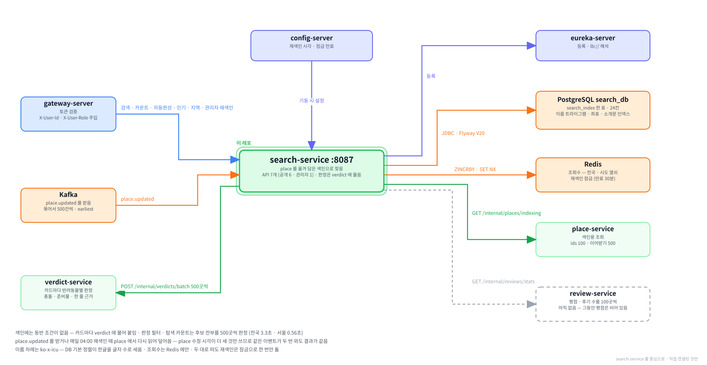

# search-service

**함께하개**는 반려동물과 함께 갈 수 있는 장소를 찾고, 우리 아이가 그곳에
들어갈 수 있는지 판정해 주는 서비스입니다.

이 저장소는 그중 **장소를 찾아 주는 서버**입니다.
장소 서비스(place)의 장소를 옮겨 담은 **색인**에서 검색어 · 지역 · 종류 · 편의시설로 장소를 찾고,
카드마다 판정 서비스(verdict)에 물어 반려동물별 판정을 붙여 돌려줍니다.
자동완성 · 인기 급상승 · 지역 목록도 여기서 냅니다.

---

**먼저 전체 그림을 보고, 이 레포가 그 안 어디에 있는지 본 뒤 읽습니다.**

**① 전체 구조 — 층으로 본 것.** 위에서 아래로 요청이 내려가고, 어느 층에 무엇이 있는지.


**② 전체 구조 — 서비스끼리 무엇을 주고받는지.** 초록 실선이 `/internal` 호출, Kafka 표가 이벤트, 하늘색 점선이 VPC 경계.


**③ 이 레포를 중심으로.** 직접 연결된 것만 남긴 그림.



<br><br>

---

## 본문 시작

<br><br>

---

## 0. 이 서비스가 하는 일

### 0-1. 한 문장

> place 의 장소를 옮겨 담은 색인에서 조건에 맞는 장소를 찾고, 카드마다 verdict 에 물어
> 반려동물별 판정 · 충돌 여부 · 준비물 · 한 줄 근거를 붙여 돌려줍니다.

예를 들어 반려견 세 마리를 등록한 사용자가 「한강」 으로 검색하면 카드가 이렇게 나옵니다.
판정은 세 마리 몫이 차례대로 붙습니다.

| 이름 | 종류 | 판정 (세 마리) | 준비물 | 한 줄 근거 |
|---|---|---|---|---|
| 노들섬 | `ETC` | 가능 · 가능 · 가능 | 목줄 · 배변봉투 | `동반 범위: 전구역 동반가능` |
| 다줄 | `ETC` | 조건부 · 조건부 · 조건부 | — | `실외 동반: 장소(실외)여부 N` |
| 클릭 | `CAMPING` | 확인 필요 · 확인 필요 · 확인 필요 | — | `동반 범위: 동반 가능 여부 정보 없음` |

같은 조건으로 판정별 장소 수(탐색 카운트)를 물으면 이렇게 나옵니다.

| 전체 | 가능 | 조건부 | 불가 | 확인 필요 |
|---|---|---|---|---|
| 166곳 | 12 | 61 | 36 | 57 |

판정 네 단계의 뜻과 한 줄 근거를 고르는 규칙은 판정 서비스의 것이라
[verdict README](https://github.com/paw-trail/verdict-service) 에 있습니다. 이 서비스는 판정을 만들지 않고 받아서 붙입니다.

---

### 0-2. 다른 서비스와의 자리

```
                                     ┌──카드마다 판정────────▶ verdict-service
브라우저 ──▶ gateway-server ──▶ search-service
                                     ├──색인용 조회──────────▶ place-service
                                     ├──평점 (아직 없음)─────▶ review-service
                                     └──조회수 · 잠금────────▶ Redis

place-service ──place.updated──▶ Kafka ──묶어서 받음──▶ search-service
```

| 상대 | 이 서비스가 하는 일 | 경로 |
|---|---|---|
| 브라우저 (게이트웨이를 거침) | 검색 · 탐색 카운트 · 자동완성 · 인기 급상승 · 조회 알림 · 지역 목록 | `/api/v1/search/**` 여섯 |
| 관리자 (게이트웨이를 거침) | 전량 재색인을 바로 돌림 | `POST /api/v1/admin/search/reindex` |
| place-service | 색인에 담을 장소를 다시 읽음 — 식별자로 몇 곳, 또는 처음부터 차례로 | `GET /internal/places/indexing` |
| Kafka | 장소가 바뀌었다는 알림(`place.updated`)을 받음 | 토픽 `place.updated` |
| verdict-service | 카드에 붙일 판정을 한 번에 500곳까지 물음 | `POST /internal/verdicts/batch` |
| review-service | 평점 평균 · 후기 수를 100곳씩 받음 — review 가 아직 없어 지금은 비어 있음 | `GET /internal/reviews/stats` |
| Redis | 조회수 순위와 재색인 잠금을 둠 | — |

**검색할 때 place 를 부르지 않습니다.** 카드에 쓰는 이름 · 주소 · 사진 · 좌표가 전부 색인에 옮겨져 있습니다.
place 는 색인을 채울 때만 부릅니다([2장](#2-색인이라는-복제본)).

**색인에는 동반 조건이 한 칸도 없습니다.** 판정은 검색할 때마다 verdict 에 묻습니다.
색인에 조건을 담으면 SQL 로 판정하고 싶어져 판정 규칙이 두 곳에 생기기 때문입니다([4장](#4-검색-한-번)).

**이벤트를 받기만 하고 내지 않습니다.** 받는 것은 `place.updated` 하나이고, 이 서비스의 DB 에는 Outbox 로 보낼 것이 없습니다.

---

### 0-3. 무엇이 들어 있나

| 들어 있는 것 | 하는 일 | 자세히 |
|---|---|---|
| 색인 | place 의 장소 19,501곳을 옮겨 담은 표 한 개 (`search_index` · 24칸) | [2장](#2-색인이라는-복제본) |
| 색인 채우기 | `place.updated` 를 받아 다시 읽기 · 매일 04:00 전량 재색인 · 관리자 재색인 | [3장](#3-색인을-채우는-두-길) |
| 검색 · 탐색 카운트 | 조건으로 좁히고 줄 세운 뒤 판정을 붙임 · 판정별 장소 수 | [4장](#4-검색-한-번) |
| 검색어 | 이름 · 별칭 · 주소는 부분 일치, 소개문은 낱말 앞부분 | [5장](#5-검색어가-걸리는-자리) |
| 인기 급상승 · 자동완성 · 지역 목록 | 조회수 순위 · 이름 앞부분 · 시도로 묶은 시군구 | [6장](#6-인기-급상승--자동완성--지역-목록) |

없는 것도 적어 둡니다. 처음 보는 사람이 가장 많이 찾는 것들입니다.

| 없는 것 | 까닭 |
|---|---|
| 지도 전용 검색 (`GET /api/v1/search/map`) | 화면에서 뺐습니다. 명세에는 남아 있습니다 |
| 카드의 혼잡도 | 부를 서비스와 화면 자리가 없습니다 |
| 오타 허용 | 0건이면 결과가 없습니다. 필요해지면 이름 유사도를 보조로 붙입니다 |
| 판정 캐시 | 판정은 verdict 의 몫이고 캐시도 그쪽에서 붙입니다 |
| JPA 엔티티 | 색인은 SQL 로만 다룹니다([11장](#11-왜-이렇게-만들었나)) |
| Inbox | 같은 이벤트를 두 번 받아도 결과가 같아 중복을 거를 표가 필요 없습니다([3장](#3-색인을-채우는-두-길)) |

---

### 0-4. 7가지만 기억하면 됩니다

**① 색인은 place 의 복제본입니다.** 장소를 고치는 곳은 place 하나이고, 이 서비스는 옮겨 담기만 합니다.
색인에 없는 값(동반 조건)은 verdict 에 묻고, 색인에 있는 값은 place 에서 다시 읽어 덮어씁니다.

**② 덮어쓰기는 place 수정 시각이 더 새로울 때만 합니다.** 이벤트로 받든 재색인으로 읽든 같은 규칙이라,
둘이 겹쳐도 옛 값이 이기지 않고 같은 이벤트가 두 번 와도 결과가 같습니다.

**③ 검색은 길이 둘입니다.** 판정으로 거르지도 인기순도 아니면 SQL 로 한 쪽만 뽑고 그 쪽만 판정합니다.
「동반 가능만」 처럼 판정으로 거르거나 인기순이면 후보를 전부 뽑아야 해서 무거워집니다.

**④ 반려동물을 안 보내면 판정 없이 답합니다.** 대표 반려동물로 채우지 않습니다. 화면이 늘 대표를 실어 보냅니다.
판정으로 거르기와 탐색 카운트는 반려동물이 있어야 하며, 없으면 400 입니다.

**⑤ 시군구는 코드가 아니라 이름이고, 시도 코드와 함께만 받습니다.** 「중구」 · 「남구」 처럼 이름이 시도마다 겹칩니다.

**⑥ 이름 차례는 한국어 규칙(`ko-x-icu`)으로 정합니다.** DB 의 기본 정렬은 한글 이름을 글자 수 차례로 세웁니다([12장](#12-막히기-쉬운-자리)).

**⑦ verdict 를 못 부르면 502 입니다.** 판정 없이 카드만 내면 「동반 가능만」 이 조용히 틀린 결과를 냅니다.

---

### 0-5. 화면에서 어디에 쓰이나

| 화면 | 쓰이는 것 | 부르는 경로 |
|---|---|---|
| 검색 결과 | 카드 · 쪽 넘김 · 필터 · 정렬 | `GET /api/v1/search` |
| 검색 결과 위 요약 | 판정별 장소 수 | `GET /api/v1/search/summary` |
| 검색창 | 치는 대로 장소 이름 10개 | `GET /api/v1/search/suggest` |
| 메인 「내 주변 인기 급상승」 | 조회수가 많은 장소 카드 | `GET /api/v1/search/trending` |
| 검색 필터의 지역 고르기 | 시도 · 시군구와 장소 수 | `GET /api/v1/search/regions` |
| 장소 상세를 열 때 | 조회수 하나 올리기 — 화면에 보이는 것은 없음 | `POST /api/v1/search/trending/views` |
| 관리자 운영 | 전량 재색인 | `POST /api/v1/admin/search/reindex` |

**「동반 가능만」 은 데려가는 모든 반려동물이 가능한 장소입니다.** 여러 마리면 장소의 판정은 가장 막히는 마리의 판정입니다.
화면 담당과 확정하기 전의 잠정값입니다.

**동물병원은 판정 배지를 그리지 않습니다.** 이 서비스는 동물병원 카드에도 판정을 싣지만(대개 확인 필요), 화면이 장소 종류(`placeType` 이 `VET`)를 보고 숨깁니다.

⚠**평점은 지금 비어 있습니다.** 후기 서비스(review)가 아직 없어 평점을 받을 곳이 없습니다.
review 가 생기면 다음 재색인부터 채워지고, 그 전까지 평점순은 사실상 이름순입니다.

<br><br>

---

## 1. 로컬에서 띄우기

### 1-1. 전체 흐름

| 순서 | 할 일 | 확인 |
|---|---|---|
| ① | 인프라 컨테이너 — postgres · redis · kafka · config-server · eureka-server | `docker compose ps` 에 `healthy` |
| ② | 재료 서비스 — place · verdict · pet · policy | 넷 다 유레카에 `UP` · place_db 에 장소가 채워져 있음 |
| ③ | 이미지 준비 — 배포된 이미지를 받거나 직접 굽기 | `docker image ls` 에 `search-service` |
| ④ | 이 서비스 실행 | 컨테이너가 `healthy` |
| ⑤ | 떴는지 확인 | 상태 확인 · 유레카 등록 · 소비 로그 |
| ⑥ | 색인을 채우고 검색 불러 보기 | 색인 행 수 · 검색이 200 |

---

### 1-2. 인프라 컨테이너

infra 레포에서 띄웁니다. 이 서비스는 postgres(`search_db`) · redis · kafka 를 모두 씁니다.

```bash
cd ../infra
docker compose up -d
docker compose ps
```

Windows 와 macOS 가 같습니다. `.env` 의 `COMPOSE_PROFILES` 에 `infra` · `platform` · `db` 가 들어 있어야
redis · kafka(`infra`) · config-server · eureka-server(`platform`) · postgres(`db`) 가 뜹니다. 프로파일의 뜻은 infra README 에 있습니다.

`search_db` 와 계정 `search_svc` 는 postgres 가 처음 뜰 때 infra 의 초기화 스크립트가 만듭니다.
표는 이 서비스가 뜰 때 Flyway 가 만듭니다.

---

### 1-3. 재료 서비스

| 서비스 | 포트 | 이 서비스가 쓰는 곳 | 준비돼 있어야 하는 것 |
|---|---|---|---|
| place-service | 8084 | 색인을 채울 때 | place_db 에 장소가 채워져 있어야 함 — 비어 있으면 색인도 빔 |
| verdict-service | 8086 | 검색할 때마다 | pet · policy 가 함께 떠 있어야 함 |
| pet-service | 8083 | verdict 가 부름 | 검색에 실을 반려동물이 한 마리 이상 |
| policy-service | 8085 | verdict 가 부름 | policy_db 에 조건이 채워져 있어야 함 — 비어 있으면 판정이 전부 확인 필요 |

place_db 는 수집 서비스(ingest)가 채우고, policy_db 는 조건 추출 서비스(extract)가 채웁니다.
비어 있으면 각 README 의 적재 절차를 따릅니다. 급하면 채워진 사람의 DB 덤프를 받는 편이 빠릅니다.

⛔**IntelliJ 와 컨테이너를 섞으면 서로 못 찾습니다.** 이 서비스는 place · verdict 의 주소를 유레카에서 받는데,
컨테이너로 뜬 서비스는 도커 안쪽 주소(`172.18.x.x`)로 등록되어 호스트에서 뜬 쪽이 그 주소에 닿지 못합니다([12장](#12-막히기-쉬운-자리)).
이 문서는 전부 컨테이너로 띄우는 길을 적습니다.

---

### 1-4. 이미지 준비

**배포된 이미지를 쓸 때** — infra 폴더에서 받습니다. Windows 와 macOS 가 같습니다.

```bash
docker compose --profile infra --profile platform --profile db --profile app pull search-service
```

**코드를 고쳐 확인할 때** — 이 레포에서 jar 를 만들고 같은 이름으로 굽습니다. 레지스트리에 올리지 않습니다.
배포 이미지는 태그를 단 `main` 에서만 굽습니다([10장](#10-운영)).

```bash
./gradlew clean bootJar
docker build -t ghcr.io/paw-trail/search-service:latest .
```

Windows 는 `./gradlew` 대신 `.\gradlew` 를 씁니다. 나머지는 같습니다.

---

### 1-5. 실행

infra 폴더에서 이 서비스와 재료 서비스를 함께 올립니다. Windows 와 macOS 가 같습니다.

```bash
docker compose --profile infra --profile platform --profile db --profile app up -d search-service place-service verdict-service pet-service policy-service eureka-server
```

`--profile` 을 명령에 붙이면 `.env` 의 `COMPOSE_PROFILES` 가 통째로 바뀌므로 필요한 프로파일을 모두 적습니다.
`up -d` 에 서비스 이름을 붙이면 기다리는 것만 함께 올라오고 eureka 는 안 올라오므로 함께 적습니다.

직접 구운 이미지를 쓸 때는 `--pull never` 를 붙여 둡니다. 이미지가 없으면 레지스트리에서 받아 오지 않고 바로 알려 주므로,
모르는 사이 배포 이미지로 도는 일이 없습니다. 코드를 고쳐 이미지를 다시 구웠다면 이 서비스만 새로 올립니다.

```bash
docker compose --profile infra --profile platform --profile db --profile app up -d --no-deps --pull never --force-recreate search-service
```

⚠**갈아 끼운 직후에는 1분쯤 기다립니다.** 상태가 `health: starting` 일 때 부르면 포트는 열려 있어도 연결이 끊깁니다.
아래 확인 명령은 `healthy` 가 될 때까지 기다리는 줄부터 시작합니다.

---

### 1-6. 떴는지 확인

상태 확인이 `UP` 인 것만으로 끝내지 않고 유레카 등록과 소비 로그까지 봅니다.
유레카 등록이 실패해도 상태 확인은 `UP` 으로 나올 수 있습니다.

Windows (PowerShell)

```powershell
while ((docker inspect -f "{{.State.Health.Status}}" pawtrail-search-service) -ne "healthy") { Start-Sleep -Seconds 3 }
foreach ($app in "SEARCH-SERVICE", "PLACE-SERVICE", "VERDICT-SERVICE") {
    (Invoke-RestMethod "http://localhost:8761/eureka/apps/$app" -Headers @{ Accept = "application/json" }).application.instance | Select-Object app, ipAddr, status
}
docker logs pawtrail-search-service 2>&1 | Select-String -Pattern "Successfully applied", "place.updated \d+건 처리" | Select-Object -Last 3
```

macOS (zsh)

```bash
until [ "$(docker inspect -f '{{.State.Health.Status}}' pawtrail-search-service)" = "healthy" ]; do sleep 3; done
for app in SEARCH-SERVICE PLACE-SERVICE VERDICT-SERVICE; do
  curl -s -H "Accept: application/json" http://localhost:8761/eureka/apps/$app | grep -o '"ipAddr":"[^"]*"\|"status":"[^"]*"' | head -2
done
docker logs pawtrail-search-service 2>&1 | grep -E "Successfully applied|place.updated [0-9]+건 처리" | tail -3
```

| 줄 | 나와야 하는 것 |
|---|---|
| 유레카 | 세 서비스가 모두 `UP` 이고 `ipAddr` 가 셋 다 `172.18.x.x` |
| Flyway | `Successfully applied … now at version v20` — 처음 뜰 때만. 다시 뜨면 이 줄 없이 `Schema "public" is up to date` |
| 소비 | `place.updated 500건 처리: 장소 …곳 · 받음 …곳 · 덮어씀 …곳 · 건너뜀 0곳` — 카프카에 남아 있던 이벤트를 처음 한 번 훑은 흔적 |

처음 뜨면 소비 그룹에 읽은 자리가 없어 토픽의 맨 앞부터 읽습니다. 카프카가 이벤트를 아직 들고 있으면
그것만으로 색인이 place 전부를 채울 수 있습니다. 소비 줄이 없으면 토픽이 비어 있는 것이라, 다음 절에서 재색인으로 채웁니다.

---

### 1-7. 색인을 채우고 검색 불러 보기

**① 색인이 비었으면 재색인을 돌립니다.** 관리자 API 를 게이트웨이를 거치지 않고 직접 부릅니다.
헤더 둘(`X-User-Id` · `X-User-Role`)은 게이트웨이가 로그인한 사용자로 채워 주는 값인데, 여기서는 손으로 싣습니다.
재색인은 아무 사용자 식별자로 돌아가므로 고정값을 씁니다.

**② 반려동물이 있는 계정 하나로 검색합니다.** 판정은 verdict 가 반려동물 주인을 확인하므로 그 계정의 식별자여야 합니다.
infra 폴더에서 돌립니다.

Windows (PowerShell)

```powershell
$base  = "http://localhost:8087/api/v1"
$admin = @{ "X-User-Id" = "00000000-0000-7000-8000-000000000001"; "X-User-Role" = "ADMIN" }

docker compose exec -T postgres psql -U pawtrail -d search_db -At -c "SELECT count(*) FROM search_index"
(Invoke-WebRequest -Method Post "$base/admin/search/reindex" -Headers $admin -SkipHttpErrorCheck).StatusCode
Start-Sleep -Seconds 10
docker compose exec -T postgres psql -U pawtrail -d search_db -At -c "SELECT count(*) FROM search_index"

$acc  = (docker compose exec -T postgres psql -U pawtrail -d pet_db -At -c "SELECT account_id FROM pet WHERE deleted_at IS NULL ORDER BY created_at LIMIT 1").Trim()
$pets = @(docker compose exec -T postgres psql -U pawtrail -d pet_db -At -c "SELECT id FROM pet WHERE account_id = '$acc' AND deleted_at IS NULL") | ForEach-Object { $_.Trim() } | Where-Object { $_ }
$user = @{ "X-User-Id" = $acc; "X-User-Role" = "USER" }
$p    = (@($pets) | ForEach-Object { "petIds=$_" }) -join "&"
$q    = [uri]::EscapeDataString("한강")

(Invoke-RestMethod "$base/search?q=$q&$p&size=3" -Headers $user).data.content | Select-Object name, placeType, @{ n = "verdicts"; e = { ($_.verdicts | ForEach-Object { $_.verdict }) -join "/" } }, evidenceSummary
(Invoke-RestMethod "$base/search/summary?q=$q&$p" -Headers $user).data
```

macOS (zsh)

```bash
BASE=http://localhost:8087/api/v1

docker compose exec -T postgres psql -U pawtrail -d search_db -At -c "SELECT count(*) FROM search_index"
curl -s -o /dev/null -w "%{http_code}\n" -X POST "$BASE/admin/search/reindex" -H "X-User-Id: 00000000-0000-7000-8000-000000000001" -H "X-User-Role: ADMIN"
sleep 10
docker compose exec -T postgres psql -U pawtrail -d search_db -At -c "SELECT count(*) FROM search_index"

ACC=$(docker compose exec -T postgres psql -U pawtrail -d pet_db -At -c "SELECT account_id FROM pet WHERE deleted_at IS NULL ORDER BY created_at LIMIT 1")
PETS=$(docker compose exec -T postgres psql -U pawtrail -d pet_db -At -c "SELECT 'petIds=' || id FROM pet WHERE account_id = '$ACC' AND deleted_at IS NULL" | paste -sd '&' -)

curl -s -G "$BASE/search" --data-urlencode "q=한강" --data "$PETS" --data "size=3" -H "X-User-Id: $ACC" -H "X-User-Role: USER"
curl -s -G "$BASE/search/summary" --data-urlencode "q=한강" --data "$PETS" -H "X-User-Id: $ACC" -H "X-User-Role: USER"
```

| 호출 | 나와야 하는 것 |
|---|---|
| 재색인 | `202` · 10초 뒤 색인 행 수가 place 의 장소 수와 같음 (19,501) — 한 바퀴가 2초 안팎입니다 |
| 검색 | 카드마다 `verdicts` 가 반려동물 수만큼 · `requiredItems` · `evidenceSummary` |
| 탐색 카운트 | `total` 이 가능 · 조건부 · 불가 · 확인 필요의 합 |

재색인을 곧바로 두 번 부르면 두 번째는 `409` `REINDEX_ALREADY_RUNNING` 이 정상입니다.
헤더를 빼고 검색하면 공통 보안 설정이 막아 `401` 입니다. 게이트웨이를 거치면 헤더는 늘 실립니다.

<br><br>

---

## 2. 색인이라는 복제본

### 2-1. 왜 복제본을 두나

검색은 조건으로 좁히고, 줄 세우고, 한 쪽만 잘라 내는 일입니다. 장소의 원본은 장소 서비스(place)에 있지만
place 의 표는 **장소를 합치고 고치기 좋게** 짜여 있어 검색에 맞지 않습니다.
이름 · 주소가 한 표에, 소스 연결 · 편의시설이 다른 표에 흩어져 있고, 검색어 · 지역 · 편의시설로 한꺼번에 찾는 조회가 없습니다.

그래서 이 서비스는 **검색에 필요한 칸만 한 표로 옮겨 담아** 그 표에서 찾습니다. 이 표를 색인이라고 부릅니다.

| | place 를 매번 부를 때 | 색인에서 찾을 때 |
|---|---|---|
| 검색 한 번의 호출 | 서비스 간 호출이 조건마다 붙음 | 이 서비스의 DB 한 번 |
| 검색어 · 반경 · 지역 | place 가 그런 조회를 모두 열어야 함 | 이 서비스가 필요한 인덱스를 가짐 |
| place 가 잠깐 내려가면 | 검색도 멈춤 | 검색은 됨 — 대신 그동안 바뀐 값은 늦게 들어옴 |

대가는 **값이 늦게 들어올 수 있다**는 것입니다. place 에서 장소가 바뀌면 이벤트를 받아 다시 읽을 때까지,
그리고 이벤트를 놓쳤다면 다음 재색인까지 옛 값이 보입니다([3장](#3-색인을-채우는-두-길)).

---

### 2-2. 한 표, 24칸

표는 `search_index` 하나입니다. 장소 한 곳이 한 행이고 식별자는 place 의 것을 그대로 씁니다.

| 무리 | 칸 | 어디서 오나 |
|---|---|---|
| 식별 | `place_id` | place |
| 이름 | `name` · `name_alias` (괄호 별칭 목록) | place |
| 종류 | `place_type` | place |
| 주소 · 지역 | `address_road` · `address_jibun` · `sido_code` · `sigungu_name` | place |
| 위치 | `geom` — 위도 · 경도를 지구 위 점으로 | place |
| 편의시설 | `facility_codes` — 코드 목록 | place |
| 상태 · 사진 | `status` · `image_url` | place |
| 검색 글 | `search_text` — 이름 · 별칭 · 도로명 · 지번 · 소개문을 낱말로 쪼갠 것 | place 값으로 이 서비스가 만듦 |
| 기준일 | `data_base_date` — 소스가 밝힌 데이터 기준일 | place |
| 평점 | `rating_avg` · `review_count` | review — 매일 재색인 때만 |
| 시각 | `place_updated_at` — place 가 이 장소를 마지막으로 고친 시각 · `indexed_at` — 이 서비스가 마지막으로 쓴 시각 | place · 이 서비스 |
| 감사 | `created_at` · `created_by` · `updated_at` · `updated_by` · `deleted_at` · `deleted_by` | 이 서비스 |

**소개문은 칸으로 담지 않습니다.** 카드에 보이지 않고 검색어로만 쓰이므로 `search_text` 에 낱말로만 들어갑니다.

**`place_updated_at` 이 이 표의 핵심입니다.** 값을 덮어쓸지 말지를 이 시각으로 정합니다([3-3](#3-3-더-새-것만-덮어씁니다)).

---

### 2-3. 담지 않는 것

| 담지 않는 것 | 까닭 |
|---|---|
| 동반 조건 (크기 · 체중 · 구역 …) | 담으면 SQL 로 판정하고 싶어져 판정 규칙이 verdict 와 여기 두 곳에 생깁니다. 판정은 검색할 때 verdict 에 묻습니다 |
| 전화번호가 있는지 | 이것으로 거르는 검색 조건이 명세에 없습니다 |
| 공급 지점 표시 (`is_supply_point`) | 지도 검색의 마커에만 실리던 칸인데 지도 검색을 뺐습니다 |
| 혼잡도 | 부를 서비스와 화면 자리가 없습니다 |

---

### 2-4. 폐업도 담습니다

폐업한 장소도 행을 지우지 않고 `status` 를 `CLOSED` 로 둡니다. place 가 그렇게 하기 때문입니다.
그 대신 **모든 검색 조회에 `status = 'ACTIVE'` 가 붙습니다.** 검색 · 탐색 카운트 · 자동완성 · 인기 급상승 · 지역 목록이 전부입니다.

지우지 않고 담아 두면, 다시 문을 연 장소가 이벤트 하나로 되살아납니다. 지웠다면 재색인까지 기다려야 합니다.

---

### 2-5. 인덱스 여섯

| 인덱스 | 무엇에 | 쓰는 조건 |
|---|---|---|
| `search_text` 의 GIN | 소개문 낱말의 앞부분 | `search_text @@ to_tsquery('simple', '수영장:*')` |
| `name` 의 트라이그램 GIN | 이름의 부분 일치 · 앞부분 일치 | `name ILIKE '%한강%'` · `name ILIKE '한강%'` |
| `geom` 의 GIST | 반경 안 · 거리 | `ST_DWithin(geom, 점, 반경)` |
| (`sido_code`, `sigungu_name`) | 지역 | `sido_code = '11' AND sigungu_name = '영등포구'` |
| `place_type` | 종류 | `place_type IN ('PARK', 'CAFE')` |
| `facility_codes` 의 GIN | 편의시설을 모두 갖춘 곳 | `facility_codes @> ARRAY['PARKING', 'PLAYGROUND']` |

트라이그램은 글자를 세 개씩 끊어 색인해 두고 부분 일치를 찾는 방식입니다. 확장 둘(`postgis` · `pg_trgm`)은 V20 이 만듭니다.

⚠**검색어 조건 전체는 인덱스 하나로 끝나지 않습니다.** 검색어 하나가 이름 · 별칭 · 도로명 · 지번 · 소개문 다섯 자리를
`OR` 로 함께 보는데, 별칭 · 도로명 · 지번에는 인덱스가 없어 표 전체를 훑습니다.
19,501행에서 40ms 대라 지금은 문제없고, 장소가 크게 늘면 다시 봅니다([13장](#13-아직-안-한-것)).

---

### 2-6. 카드에 나가는 값

| 카드 칸 | 색인에서 | 규칙 |
|---|---|---|
| 주소 | `address_road` · `address_jibun` | 도로명, 없으면 지번 — place 상세와 같은 규칙 |
| 좌표 | `geom` | 위도 `lat` · 경도 `lon` 을 소수 7자리로. 위치를 보냈는지와 상관없이 늘 실림 — 웹 화면이 거리를 직접 계산하는 데 씀([11-14](#11-14-웹-화면이-내-위치를-보내지-않는-이유)) |
| 거리 | `geom` | 위치를 보냈을 때만 미터로. 안 보냈으면 `null` |
| 기준일 | `data_base_date` | 소스가 밝힌 날짜 그대로 |
| 평점 · 후기 수 | `rating_avg` · `review_count` | 후기가 없으면 평점 `null` · 후기 수 0 |

카드의 판정 · 충돌 여부 · 준비물 · 한 줄 근거는 색인이 아니라 verdict 에서 옵니다([4장](#4-검색-한-번)).

<br><br>

---

## 3. 색인을 채우는 두 길

### 3-1. 한눈에

| 길 | 언제 | place 에서 읽는 방식 | 평점 |
|---|---|---|---|
| `place.updated` 소비 | place 가 장소를 만들거나 고칠 때마다 | 바뀐 장소만 식별자로 — 100곳씩 | 건드리지 않음 |
| 매일 재색인 | 매일 04:00 | 처음부터 차례로 — 500곳씩 이어받기 | review 에서 100곳씩 받아 갈아 끼움 |
| 관리자 재색인 | 관리자가 부를 때 | 매일 재색인과 같음 | 같음 |

**두 길 모두 place 에서 값을 다시 읽습니다.** 이벤트에는 장소 식별자(`placeId`)만 들어 있어서,
이벤트를 받으면 그 장소를 place 의 색인용 조회(`GET /internal/places/indexing`)로 다시 읽어 옵니다.

**덮어쓰는 규칙도 하나입니다.** 어느 길로 읽었든 place 수정 시각이 더 새로울 때만 덮어씁니다([3-3](#3-3-더-새-것만-덮어씁니다)).

---

### 3-2. place.updated 를 받으면

```
Kafka ──이벤트를 묶어서 (한 번에 최대 500건)──▶ PlaceUpdatedConsumer
                                                  │ placeId 를 추리고 같은 장소는 한 번만
                                                  ▼
                                            SearchIndexService ──100곳씩──▶ place  GET /internal/places/indexing?ids=
                                                  │
                                                  ▼
                                            search_index  넣거나 · 더 새 것만 덮어씀
```

이벤트를 한 건씩 받지 않고 묶어서 받습니다. 같은 장소가 한 묶음에 여러 번 오면 한 번만 읽습니다.
어차피 place 의 지금 값을 읽으므로 몇 번 왔는지는 결과를 바꾸지 않습니다.

묶음 하나를 처리하면 로그가 한 줄 남습니다.

```
place.updated 500건 처리: 장소 464곳 · 받음 271곳 · 덮어씀 271곳 · 건너뜀 0곳
```

| 숫자 | 뜻 |
|---|---|
| 500건 | 받은 이벤트 수 |
| 장소 | 중복을 뺀 장소 수 — place 에 물은 수 |
| 받음 | place 가 돌려준 수. 적으면 place 가 모르는 식별자가 섞인 것이고 경고가 한 줄 더 남습니다 |
| 덮어씀 | 실제로 쓴 행 수. 이미 같은 수정 시각으로 들어 있던 장소는 세지 않습니다 |
| 건너뜀 | 이름 · 종류 · 좌표 같은 필수 칸이 비어 넣지 않은 수 |

묶어서 받는 것은 설정이 아니라 리스너 코드(`@KafkaListener(batch = "true")`)에 적혀 있습니다. 까닭은 [12장](#12-막히기-쉬운-자리)에 있습니다.

---

### 3-3. 더 새 것만 덮어씁니다

넣고 덮어쓰는 SQL 이 하나이고, 끝에 조건이 한 줄 붙어 있습니다.

```sql
INSERT INTO search_index (place_id, name, … , place_updated_at, indexed_at, …)
VALUES (…)
ON CONFLICT (place_id) DO UPDATE SET
    name             = EXCLUDED.name,
    …
    place_updated_at = EXCLUDED.place_updated_at
WHERE search_index.place_updated_at < EXCLUDED.place_updated_at
```

처음 보는 장소는 넣고, 있는 장소는 **새로 읽은 값의 place 수정 시각이 지금 담긴 것보다 늦을 때만** 덮어씁니다.
이 한 줄이 두 가지 경우를 함께 막습니다.

| 경우 | 이 줄이 없으면 | 이 줄이 있으면 |
|---|---|---|
| 재색인이 옛 값을 늦게 씀 — 재색인이 A 를 읽은 뒤 A 가 고쳐지고, 이벤트가 먼저 새 값을 씀 | 재색인의 옛 값이 새 값을 덮음 | 옛 값의 시각이 더 이르므로 쓰지 않음 |
| 같은 이벤트가 두 번 옴 | 같은 값을 두 번 씀 (해는 없지만 셀 수 없음) | 두 번째는 0행 |

이벤트의 차례가 뒤바뀌어도 상관없습니다. 이벤트에는 값이 없고, 받을 때마다 place 의 지금 값을 읽기 때문입니다.

**그래서 Inbox 가 없습니다.** 다른 서비스는 같은 이벤트를 두 번 처리하지 않으려고 받은 이벤트를 표(Inbox)에 적어 둡니다.
여기서는 두 번 처리해도 결과가 같으므로 적어 둘 이유가 없습니다.

실물로 확인했습니다. 카프카에 쌓여 있던 `place.updated` 65,259건을 처음부터 다시 흘렸을 때, 한 행도 다시 쓰지 않았고
마지막으로 쓴 시각(`indexed_at`)도 글자까지 같았습니다.

---

### 3-4. 잘못된 이벤트와 실패

**장소 식별자가 없는 이벤트는 그 자리에서 실패시킵니다.** 읽지 못한 글이나 빈 payload 입니다.
조용히 버리면 처리된 것으로 넘어가 아무도 모릅니다.

묶음에서 몇 번째가 깨졌는지를 담아 던지므로, 오류 처리기가 그 앞의 이벤트는 처리된 것으로 넘기고
**깨진 한 건만** 1 · 2 · 4초 간격으로 다시 시도한 뒤 `place.updated.dlq` 로 보냅니다. 뒤의 이벤트는 다시 받아 처리합니다.

⚠**place 를 못 부르면 묶음 전체가 실패합니다.** 같은 간격으로 세 번 다시 시도하고, 끝내 안 되면 묶음의 이벤트가 전부 `.dlq` 로 갑니다.
이벤트에는 식별자만 있어 잃는 것은 **그 장소들이 다음 재색인까지 옛 값으로 보인다**는 것뿐입니다. 매일 재색인이 메웁니다.

| 실패 | 다시 시도 | 끝내 안 되면 | 메우는 것 |
|---|---|---|---|
| 식별자 없는 이벤트 | 그 한 건 · 세 번 | 그 한 건이 `.dlq` | 없음 — 애초에 읽을 장소가 없음 |
| place 를 못 부름 | 묶음 전체 · 세 번 | 묶음 전체가 `.dlq` | 매일 재색인 |

---

### 3-5. 처음 붙을 때

소비 그룹(`search-service`)이 처음 붙으면 읽은 자리가 없어 **토픽의 맨 앞부터** 읽습니다(`earliest`).
카프카가 이벤트를 아직 들고 있으면 그것만으로 색인이 채워집니다.

실물에서 이렇게 됐습니다. 처음 띄웠을 때 쌓여 있던 65,259건을 13초 남짓에 훑었고, 색인이 place 의 장소 19,501곳을 전부 채웠습니다.
옛 적재가 모든 장소에 `place.updated` 를 냈기 때문입니다. 토픽이 비어 있으면 관리자 재색인으로 채웁니다([1-7](#1-7-색인을-채우고-검색-불러-보기)).

---

### 3-6. 매일 재색인

매일 04:00(Asia/Seoul)에 돕니다. 시각은 설정 저장소의 `app.search.reindex.cron` 입니다([9장](#9-설정값)).

```
① place 를 식별자 차례로 500곳씩 이어받음     GET /internal/places/indexing?after=…&size=500
   받을 때마다 넣거나 · 더 새 것만 덮어씀     받은 수가 500 보다 적으면 끝
② review 평점을 100곳씩 받아 갈아 끼움       GET /internal/reviews/stats?placeIds=…
③ 색인에만 있고 이번에 place 가 주지 않은 행을 셈 — 지우지 않음
④ 끝 요약 로그 한 줄
```

평소 재색인은 **거의 아무것도 덮어쓰지 않습니다.** 이벤트가 이미 맞춰 두었기 때문입니다. 재색인은 놓친 이벤트를 메우는 그물입니다.

```
재색인 끝 (ADMIN): place 40쪽 · 19501곳 읽음 · 덮어씀 0곳 · 건너뜀 0곳 · 평점 바뀜 0곳 (review 를 못 불러 남은 평점은 그대로) · 색인에만 있는 행 0 · 1977ms
```

| 부분 | 뜻 |
|---|---|
| `(ADMIN)` | 누가 걸었나 — 스케줄이면 `SCHEDULE` |
| `place 40쪽 · 19501곳 읽음` | 500곳씩 40번 받았다는 뜻 |
| `덮어씀 0곳` | 이벤트가 이미 맞춰 둬서 다시 쓸 것이 없었음 |
| `평점 바뀜 0곳 (…그대로)` | review 가 없어 평점을 못 받았고, 남은 평점은 지우지 않았음 |
| `색인에만 있는 행 0` | [3-9](#3-9-색인에만-있는-행) |
| `1977ms` | 한 바퀴 2초 |

**평점은 값이 바뀐 곳만 씁니다.** 후기가 없는 장소는 평점 `null` · 후기 수 0 으로 맞춥니다.
review 응답에 없는 장소가 그것이며, 후기가 전부 지워진 장소의 옛 평점이 남지 않게 하려는 것입니다.

---

### 3-7. 멈추는 자리

| 무엇이 안 되나 | 재색인은 | 평점 · 행 세기 |
|---|---|---|
| place 를 못 부름 | 그 쪽에서 멈춤 — 이미 쓴 행은 남음 | 건너뜀 |
| place 가 깨진 쪽을 줌 (비어 있는 원소 · 식별자 없는 원소) | 그 쪽에서 멈춤 | 건너뜀 |
| review 를 못 부름 | 끝까지 돎 | 남은 평점은 그대로 둠 |

**place 가 멈추면 평점과 행 세기를 건너뜁니다.** 둘 다 한 바퀴를 다 봤을 때만 뜻이 있어서입니다.
반만 본 목록으로 평점을 갈거나 「색인에만 있는 행」을 세면 멀쩡한 행까지 세어 숫자가 틀립니다.

**깨진 쪽은 거르지 않고 멈춥니다.** 받은 수가 500 보다 적으면 끝으로 보는데, 깨진 원소를 걸러 500 이 499 가 되면
마지막 쪽으로 잘못 알고 뒤를 읽지 않은 채 성공으로 끝나기 때문입니다.

**review 를 못 부르면 평점만 그대로 둡니다.** 못 받은 것을 「후기 없음」 으로 읽으면 멀쩡한 평점이 한 번에 전부 지워집니다.

---

### 3-8. 한 번에 한 대만

이 서비스는 여러 대로 뜰 수 있습니다(운영은 두 대). 두 대가 각자 04:00 스케줄을 돌리거나, 관리자 요청이 돌고 있지 않은 대로 가면 재색인이 겹칩니다.
그래서 **Redis 에 잠금 하나**(`search:reindex:lock`)를 두고 잡은 쪽만 돌립니다.

| 문 | 잠금을 잡으면 | 못 잡으면 |
|---|---|---|
| 매일 스케줄 | 그 자리에서 끝까지 돌리고 풂 | 조용히 건너뜀 — 다른 대가 돌고 있다는 뜻 |
| 관리자 `POST /api/v1/admin/search/reindex` | `202` 로 바로 답하고 뒤에서 돌린 뒤 풂 | `409` `REINDEX_ALREADY_RUNNING` |

**잡을 때는 「없을 때만 넣기」 와 만료를 한 번에 합니다**(`SET NX` + 30분). 재색인 중에 서버가 죽어 풀어 줄 사람이 없어도
만료가 지나면 저절로 풀립니다. 사람 없이 매일 도는 작업이라 잠긴 채로 남으면 아무도 모르기 때문입니다.

**풀 때는 자기가 잡은 잠금일 때만 지웁니다.** 잡을 때 넣은 표(무작위 값)가 그대로일 때만 지우는 작은 스크립트(Lua)를 씁니다.
재색인이 만료보다 오래 걸려 잠금이 풀렸고 그 사이 다른 대가 잡았다면, 그냥 지웠을 때 남의 잠금을 풀어 셋째 실행이 겹쳐 들어오기 때문입니다.

한 바퀴가 2초라 만료 30분은 넉넉합니다. 실행이 만료보다 길어졌는지는 로그로 드러납니다 —
풀려고 보니 잠금이 이미 없으면 `재색인 잠금이 이미 풀려 있었습니다` 경고가 남습니다.

---

### 3-9. 색인에만 있는 행

재색인 끝에 **이번 바퀴에서 place 가 주지 않았는데 색인에는 있는 행**을 셉니다. 지우지는 않습니다.

place 는 장소를 지우지 않으므로(폐업도 상태로 남김) 운영에서는 늘 0 이어야 합니다.
0 이 아니게 되는 경우는 **로컬에서 place_db 를 비우고 다시 적재했을 때**뿐입니다. 장소 식별자가 새로 발급되어 옛 식별자가 색인에 남습니다.
그때는 경고가 한 줄 남으므로, 색인을 비우고 재색인합니다.

```bash
cd ../infra
docker compose exec -T postgres psql -U pawtrail -d search_db -c "TRUNCATE search_index"
```

그다음 [1-7](#1-7-색인을-채우고-검색-불러-보기) 의 관리자 재색인을 부릅니다. Windows 와 macOS 가 같습니다.

지우는 길을 두지 않은 까닭은, 운영에서 생길 수 없는 일에 지우는 경로를 두면 버그가 났을 때 오히려 색인을 날리는 길이 되기 때문입니다.
세기만 하면 생긴 줄은 드러나고 지우는 판단은 사람이 합니다.

<br><br>

---

## 4. 검색 한 번

### 4-1. 한눈에

```
요청 ──▶ 조건 만들기 ──▶ 400 검사 ──▶ 길 고르기 ─┬─ SQL 로 쪽을 자르는 길 ──▶ 개수 · 한 쪽 ──────▶ 그 쪽만 판정 ──▶ 카드
                                                 └─ 후보를 다 뽑는 길 ─────▶ 후보 전부 ──▶ 인기순 · 전수 판정 ──▶ 거르고 쪽 자르기 ──▶ 카드
```

| 단계 | 하는 일 | 어디서 |
|---|---|---|
| 조건 만들기 | 파라미터를 검색 조건 하나로 — 검색어는 띄어쓰기로 나누고, 위치만 오면 반경 20km | `SearchController` |
| 400 검사 | 말이 안 되는 요청을 막음 | `SearchService` |
| 길 고르기 | 판정으로 거르거나 인기순이면 후보를 다 뽑는 길, 아니면 SQL 로 쪽을 자르는 길 | `SearchService` |
| 찾기 | 색인에서 조건으로 좁히고 줄 세움 | `SearchIndexRepositoryImpl` · `SearchSql` |
| 판정 | verdict 에 500곳씩 물음 | `VerdictProviderImpl` |
| 카드 | 색인 값에 판정을 붙임 | `SearchCardOutput` |

---

### 4-2. 파라미터

| 이름 | 뜻 | 없을 때 | 지켜야 하는 것 |
|---|---|---|---|
| `q` | 검색어 — 띄어쓰기로 나눈 낱말마다 모두 맞아야 함 | 검색어 조건 없음 | |
| `sidoCode` | 시도 코드 (`11` 서울 …) | 전국 | |
| `sigunguName` | 시군구 이름 (`영등포구`) | 시도 전체 | `sidoCode` 와 함께만 |
| `lat` · `lon` | 주변을 찾을 기준점 — 장소 좌표를 기준으로 찾을 때 씀. 웹 화면은 보내지 않음([11-14](#11-14-웹-화면이-내-위치를-보내지-않는-이유)) | 거리 조건 · 거리 없음 | 둘이 함께 |
| `radius` | 반경 (미터) | 위치가 있으면 20,000 | 1 이상 |
| `placeType` | 종류 — 여럿이면 그중 하나 | 전부 | |
| `facility` | 편의시설 — 여럿이면 모두 갖춘 곳 | 조건 없음 | |
| `verdict` | 남길 장소 판정 (`ALLOWED` …) | 판정으로 거르지 않음 | `petIds` 가 있어야 함 |
| `petIds` | 데려가는 반려동물 | 판정 없이 장소 칸만 | 100마리까지 |
| `sort` | `distance` · `rating` · `popular` | 위치가 있으면 거리순, 없으면 평점순 | `distance` 는 위치가 있어야 함 |
| `page` · `size` | 쪽 번호 · 쪽 크기 | 0 · 20 | 0 이상 · 1~100 |

**목록 파라미터는 같은 이름을 되풀이해 보냅니다.** `placeType=PARK&placeType=CAFE` 입니다.
명세의 `placeType[]` 에서 `[]` 는 "여러 개" 라는 표기이고 이름에 붙이지 않습니다.

---

### 4-3. 400 이 나는 요청

전부 `400` `VALIDATION_FAILED` 입니다. 요청을 고쳐야 하는 경우라 서버에 닿기 전에 막습니다.

| 요청 | 왜 막나 |
|---|---|
| `sigunguName` 만 주고 `sidoCode` 가 없음 | 「중구」 · 「남구」 처럼 시군구 이름이 시도마다 겹침 |
| `lat` · `lon` 중 하나만 | 위치가 반쪽이라 거리를 잴 수 없음 |
| `radius` 가 0 이하 | 아무것도 안 들어감 |
| `sort=distance` 인데 위치가 없음 | 거리를 잴 기준점이 없음 |
| 모르는 `sort` 값 | 조용히 다른 정렬로 바꾸지 않음 |
| `verdict` 를 줬는데 `petIds` 가 없음 | 판정할 반려동물이 없어 거를 수 없음 |
| `petIds` 가 100마리를 넘음 | verdict 가 한 번에 받는 상한 |
| `page` 가 음수 · `size` 가 1~100 밖 | |

탐색 카운트(`/summary`)는 `petIds` 가 없어도 400 입니다. 셀 판정이 없기 때문입니다.

---

### 4-4. 정렬

| `sort` | 차례 | 같은 값끼리 |
|---|---|---|
| `distance` | 가까운 곳부터 | 이름 가나다 → 장소 식별자 |
| `rating` | 평점이 높은 곳부터 · 평점이 없는 곳은 맨 뒤 | 후기 수가 많은 곳 → 이름 가나다 → 장소 식별자 |
| `popular` | 누적 조회수가 많은 곳부터 | 이름 가나다 → 장소 식별자 |
| 안 줌 | 위치가 있으면 `distance`, 없으면 `rating` | 위와 같음 |

**차례의 맨 끝에 늘 장소 식별자가 붙습니다.** 같은 값끼리의 차례가 요청마다 흔들리면 쪽을 넘길 때
같은 장소가 두 번 나오거나 빠지기 때문입니다.

**평점이 지금은 전부 비어 있어 평점순은 사실상 이름순입니다**([0-5](#0-5-화면에서-어디에-쓰이나)). 이름 차례의 규칙은 [5-6](#5-6-이름-차례) 에 있습니다.

---

### 4-5. SQL 로 쪽을 자르는 길

판정으로 거르지도 않고 인기순도 아닐 때입니다. 대부분의 검색이 이 길로 갑니다.

```
① 개수        SELECT count(*) FROM search_index WHERE (조건)
② 한 쪽        SELECT place_id FROM search_index WHERE (조건) ORDER BY (정렬) LIMIT 20 OFFSET 0
③ 판정        verdict 에 그 한 쪽만 — 한 번
④ 카드 값      SELECT 이름 · 주소 · 사진 · 거리 · 평점 … FROM search_index WHERE place_id IN (그 한 쪽)
```

verdict 는 한 쪽(최대 100곳)만 판정하므로 한 번 부릅니다. 응답은 110ms 안팎입니다([10장](#10-운영)).
쪽 번호가 전체 개수를 넘으면 빈 목록을 돌려주고 verdict 를 부르지 않습니다.

---

### 4-6. 후보를 다 뽑는 길

판정으로 거르거나(`verdict=ALLOWED` 같은 「동반 가능만」) 인기순일 때입니다.
**판정과 조회수가 색인 밖에 있어 SQL 로는 거르거나 줄 세울 수 없습니다.** 그래서 후보를 전부 뽑아 이 서비스 안에서 거르고 줄 세운 뒤 쪽을 자릅니다.

```
① 후보 전부     SELECT place_id FROM search_index WHERE (조건) ORDER BY (정렬)
② 인기순이면    Redis 에서 후보들의 조회수를 1,000개씩 받아 많은 차례로 다시 세움 — 같으면 이름순 그대로
③ 판정 필터면   후보 전부를 verdict 에 500곳씩 판정 (전수 판정) → 장소 판정이 남길 값인 곳만 남김
④ 쪽 자르기     남은 수가 전체 개수 · 그중 한 쪽
⑤ 카드         판정 필터였으면 ③ 의 결과를 그대로 싣고, 인기순만이었으면 그 한 쪽만 새로 판정
```

**이 길은 무겁습니다.** 조건이 넓을수록 후보가 많고, 판정 필터면 후보 수만큼 verdict 를 부릅니다.

| 조건 | 후보 | verdict 호출 | 걸린 시간 |
|---|---|---|---|
| 서울 · 동반 가능만 | 2,674곳 | 6번 | 0.56초 |
| 전국 · 동반 가능만 | 19,501곳 | 40번 | 3.3초 |

화면은 보통 위치나 지역을 함께 보내므로 후보가 수백 곳이고 1초 안쪽입니다. 전국 3.3초는 조건 없이 「동반 가능만」 만 켠 가장 무거운 경우입니다.
판정 캐시는 verdict 에서 부하를 잰 뒤 붙입니다([13장](#13-아직-안-한-것)).

이 길을 지나면 로그가 한 줄 남습니다. 시간을 잴 때 이 줄을 봅니다.

```
후보를 다 뽑는 검색: 정렬 RATING · 판정 필터 [ALLOWED] · 남은 822곳 · 3305ms
```

---

### 4-7. 장소 판정과 「동반 가능만」

verdict 는 반려동물 한 마리마다 판정을 줍니다. 판정으로 거를 때는 **장소 하나의 판정**이 필요해서, 데려가는 반려동물 가운데
**가장 막히는 마리의 판정**을 그 장소의 판정으로 봅니다. 막히는 차례는 불가 → 확인 필요 → 조건부 → 가능입니다.

| 첫째 | 둘째 | 장소 판정 | 「동반 가능만」 에 |
|---|---|---|---|
| 가능 | 가능 | 가능 | 남음 |
| 가능 | 조건부 | 조건부 | 빠짐 |
| 가능 | 불가 | 불가 | 빠짐 |
| 조건부 | 확인 필요 | 확인 필요 | 빠짐 |

그래서 **「동반 가능만」 은 모든 마리가 가능한 곳**입니다. 한 마리라도 막히면 데려갈 수 없기 때문입니다.
화면 담당과 확정하기 전의 잠정값이고, 카드에는 마리마다의 판정이 그대로 실리므로 화면이 다르게 보여 줄 수 있습니다.

---

### 4-8. 반려동물이 없을 때

`petIds` 를 안 보내도 verdict 를 부릅니다. 반려동물 없이 부르면 verdict 는 판정 없이 **장소 칸**만 채워 줍니다.

| 카드 칸 | 반려동물이 있을 때 | 없을 때 |
|---|---|---|
| `verdicts` | 마리마다 판정 | 빈 목록 |
| `hasConflict` | 소스끼리 조건이 엇갈리는지 | 같음 — 반려동물과 무관 |
| `requiredItems` | 준비물 | 같음 |
| `evidenceSummary` | 한 줄 근거 | `null` — 근거를 고르는 기준이 판정이라서 |

**대표 반려동물로 채우지 않습니다.** 대표가 누구인지는 사용자 서비스가 알고, 화면이 이미 알고 있어 늘 실어 보냅니다.
서버가 채우면 「이 검색은 누구 기준인가」 가 응답에서 안 보이게 됩니다.

---

### 4-9. 탐색 카운트

`GET /api/v1/search/summary` 는 같은 조건에서 **장소 판정별 장소 수**를 돌려줍니다. 후보 전부를 판정하므로 4-6 의 길과 무게가 같습니다.

```json
{ "total": 166, "allowed": 12, "conditional": 61, "notAllowed": 36, "unknown": 57 }
```

`total` 은 조건에 맞는 장소 수이고 넷의 합과 같습니다. 판정으로 거르는 파라미터(`verdict`)와 정렬 · 쪽은 받지 않습니다.

---

### 4-10. verdict 를 못 부르면

검색 전체가 `502` `VERDICT_UNAVAILABLE` 입니다. 판정 없이 카드만 내지 않습니다.

| 판정 없이 카드만 낸다면 | 무엇이 틀리나 |
|---|---|
| 「동반 가능만」 | 걸러 낼 판정이 없어 조용히 0곳이 됨 |
| 탐색 카운트 | 전부 0 |
| 카드 배지 | 「불러오지 못함」 과 「확인 필요」 가 구분되지 않음 |

**사용자 헤더 둘이 verdict 까지 따라갑니다.** verdict 는 반려동물의 주인을 확인하려고 `X-User-Id` · `X-User-Role` 을 봅니다.
공통 모듈의 내부 호출 빌더가 지금 요청의 두 헤더를 그대로 실어 보내므로 이 서비스가 따로 할 일은 없습니다.
그래서 verdict 호출은 **사용자 요청 안에서만** 됩니다. 재색인이나 이벤트 소비에서는 verdict 를 부르지 않습니다.

<br><br>

---

## 5. 검색어가 걸리는 자리

### 5-1. 다섯 자리

검색어의 낱말 하나는 아래 다섯 자리 **가운데 하나에만 걸리면** 됩니다.

| 자리 | 걸리는 방식 | 예 — 이 낱말로 | 이 장소가 나옴 |
|---|---|---|---|
| 이름 | 부분 일치 | 「나루」 | 송파나루공원 |
| 별칭 | 부분 일치 | 「여의도공원」 | 여의도한강공원 (별칭 `여의도공원`) |
| 도로명 주소 | 부분 일치 | 「여의동로」 | 여의동로에 있는 장소 |
| 지번 주소 | 부분 일치 | 「당산동」 | 도로명이 없고 지번이 당산동인 장소 |
| 소개문 | 낱말 앞부분 | 「수영장」 | 소개문에 「수영장이 있는」 이 적힌 장소 |

별칭은 place 가 이름의 괄호에서 떼어 둔 것입니다. 이름이 `이랜드크루즈(한강유람선)` 이면 별칭에 `한강유람선` 이 들어갑니다.

---

### 5-2. 낱말이 여럿이면

검색어를 띄어쓰기로 나누고 **낱말마다 모두 맞아야** 합니다. 낱말끼리는 다른 자리에 걸려도 됩니다.

| 검색어 | 나오는 장소 |
|---|---|
| 「한강」 | 이름 · 주소 · 소개문 어디든 한강이 있는 곳 |
| 「한강 영등포구」 | 그 가운데 영등포구에 있는 곳 — 한강은 이름에, 영등포구는 주소에 걸려도 됨 |

앞뒤 공백과 낱말 사이의 여러 칸은 하나로 봅니다. 검색어가 비어 있으면 검색어 조건이 없는 것입니다.

---

### 5-3. 부분 일치와 낱말 앞부분

두 방식을 함께 쓰는 까닭은 한국어 이름과 문장이 각각 다르게 생겼기 때문입니다.

| 방식 | 잘 잡는 것 | 못 잡는 것 |
|---|---|---|
| 부분 일치 (이름 · 별칭 · 주소) | 붙여 쓴 이름 속 낱말 — 「송파나루공원」 의 「나루」 | 없음 — 대신 인덱스를 잘 못 탐 |
| 낱말 앞부분 (소개문) | 조사가 붙은 낱말 — 「수영장이」 를 「수영장」 으로 | 낱말 가운데 — 「야외수영장」 을 「수영장」 으로는 못 찾음 |

소개문은 형태소를 가르지 않고 띄어쓰기로만 낱말을 나눕니다(`simple` 사전). 긴 문장을 부분 일치로 훑으면 느리고,
형태소 분석기를 붙이면 확장 설치와 사전 관리가 따라와 지금 규모에 비해 무겁기 때문입니다.
이름에 「야외수영장」 이 있는 장소라면 이름의 부분 일치로 잡힙니다.

---

### 5-4. 특수 문자

사용자가 친 검색어는 **값으로만** 넘기고 SQL 문장에 이어 붙이지 않습니다. 그 위에 두 가지를 더 걷어 냅니다.

| 글자 | 그대로 두면 | 이 서비스는 |
|---|---|---|
| `%` · `_` | 부분 일치에서 「아무 글자」 라는 뜻이 되어 전부 걸림 | 글자 그대로 찾음 — 「100%」 는 100% 가 이름에 든 곳만 |
| `&` `\|` `!` `(` `)` `:` `*` | 소개문 검색의 연산자로 읽혀 오류가 남 | 소개문 검색에서만 걷어 내고 남은 글자로 찾음 |

따옴표 · 연산자 · 백슬래시 · `'); DROP TABLE search_index;--` 같은 검색어도 오류 없이 평범한 글자로 찾는 것을 시험이 확인합니다.

---

### 5-5. 오타는 허용하지 않습니다

「한간」 으로 찾으면 「한강」 이 나오지 않습니다. 결과가 0건이면 0건입니다.

오타 허용은 비슷한 이름을 점수로 매겨 끼워 넣는 일이라, 결과가 있는 검색에도 엉뚱한 장소가 섞여 들어옵니다.
필요해지면 **결과가 0건일 때만** 이름 유사도로 보조하는 쪽으로 붙입니다. 트라이그램 확장이 이미 있어 추가 설치는 없습니다.

---

### 5-6. 이름 차례

이름으로 줄 세우는 자리는 전부 **한국어 규칙**(`COLLATE "ko-x-icu"`)을 씁니다.

DB 의 기본 정렬(`en_US.utf8`)은 한글 이름을 가나다로 세우지 않습니다. 같은 이름 아홉 개를 세 규칙으로 세워 보면 이렇습니다.

| 규칙 | 차례 |
|---|---|
| DB 기본 | 다줄 → 클릭 → 개이크 → 노들섬 → 더펫츠 → (주)카페 → apple → Cafe → ㈜한강 |
| 코드 순 (`C`) | (주)카페 → Cafe → apple → ㈜한강 → 개이크 → 노들섬 → 다줄 → 더펫츠 → 클릭 |
| 한국어 (`ko-x-icu`) | (주)카페 → ㈜한강 → 개이크 → 노들섬 → 다줄 → 더펫츠 → 클릭 → apple → Cafe |

DB 기본은 한글 음절을 1단계 비교에서 사실상 무시해 **글자 수가 먼저 오는 차례**가 됩니다. 코드 순은 한글은 맞지만 영문 대문자가 앞에 섭니다.
한국어 규칙은 한글을 가나다로, 한글을 영문보다 앞에, 대소문자를 섞어 세웁니다.

| 쓰는 자리 | |
|---|---|
| 검색 | 이름순 · 평점이나 거리가 같을 때 · 인기순 동점 |
| 자동완성 | 앞부분 무리 · 부분 일치 무리 안에서 |
| 지역 목록 | 시군구 이름 |

⚠**PostgreSQL 의 기본 정렬이 다르면(예: `C.UTF-8`) 이 문제가 안 보일 수 있습니다.** 그래서 검색 SQL 시험(`SearchQueryTest`)이
기본 정렬이 같은 시험 컨테이너에서 가나다 차례를 확인합니다. 누가 규칙을 지우면 그 시험이 깨집니다.

---

### 5-7. 두 글자 검색어와 인덱스

이름의 트라이그램 인덱스는 글자를 세 개씩 끊어 둔 것이라, 「한강」 같은 두 글자 부분 일치로는 인덱스를 못 탑니다.
그런데 재 보면 검색에서는 차이가 없습니다.

| 조회 | 두 글자 | 네 글자 | 까닭 |
|---|---|---|---|
| 검색어 조건 (DB 안) | 42ms · 표 전체 | 44ms · 표 전체 | 다섯 자리를 `OR` 로 보는데 별칭 · 주소에 인덱스가 없어 글자 수와 상관없이 늘 표를 훑음 |
| 자동완성 앞부분 | 0.6ms · 인덱스 | — | 앞부분 일치(`한강%`)는 두 글자도 인덱스를 탐 |

19,501행에서 표를 훑는 데 40ms 대라 지금은 그대로 둡니다. 장소가 크게 늘면 주소 트라이그램 인덱스와 조건 구조를 다시 봅니다([13장](#13-아직-안-한-것)).

<br><br>

---

## 6. 인기 급상승 · 자동완성 · 지역 목록

### 6-1. 조회수는 Redis 에만 있습니다

장소마다의 조회수는 DB 칸이 아니라 **Redis 의 정렬 집합**에 있습니다. 원소가 장소 식별자이고 점수가 조회수입니다.

| 열쇠 | 무엇 |
|---|---|
| `search:trending:all` | 전국 |
| `search:trending:sido:{시도 코드}` | 시도마다 — 「내 주변 인기 급상승」 이 시도로 거를 때 |

**기간을 자르지 않은 누적 조회수입니다.** 「최근 7일」 로 하려면 날짜별 열쇠를 만들어 합산해야 하는데,
실사용자가 없어 순위가 거의 움직이지 않으므로 그 복잡도를 사지 않았습니다(명세 결정). 그래서 열쇠에 만료도 없습니다.

**DB 칸을 두지 않았습니다.** 조회는 장소 상세를 열 때마다 생기는 쓰기라 DB 에 두면 행 갱신이 잦고, 순위는 Redis 의 정렬 집합이 바로 줍니다.

---

### 6-2. 조회 알림

화면이 **장소 상세를 열 때** 이 서비스에 알립니다. 화면에는 아무것도 보이지 않습니다.

```
POST /api/v1/search/trending/views
{ "placeId": "01a09015-85fa-7f60-b85c-030b6d0f3f54" }
```

| 경우 | 응답 | 조회수 |
|---|---|---|
| 색인에 있는 장소 | `204` | 전국 열쇠 · 그 장소의 시도 열쇠에 하나씩 |
| 시도를 모르는 장소 | `204` | 전국 열쇠에만 |
| 색인에 없는 장소 | `204` | 세지 않음 — 잘못 보낸 식별자가 순위에 끼지 않게 |
| `placeId` 가 없음 | `400` `VALIDATION_FAILED` | — |

**셌는지 안 셌는지를 화면에 알리지 않습니다.** 늘 `204` 입니다. 화면이 할 일이 달라지지 않기 때문입니다.
같은 사람이 같은 장소를 여러 번 열면 그만큼 셉니다.

누가 알릴지는 최근 본 장소(사용자 서비스)와 같은 결로 정했습니다 — 화면이 부릅니다.
장소 서비스가 상세 조회를 받을 때 대신 알리면 서비스 사이에 호출이 하나 더 생기기 때문입니다.

---

### 6-3. 인기 급상승

`GET /api/v1/search/trending` 은 조회수가 많은 장소를 **검색과 같은 카드 모양**으로 돌려줍니다. 쪽은 없습니다.

| 파라미터 | 뜻 | 없을 때 |
|---|---|---|
| `sidoCode` | 그 시도의 순위 | 전국 |
| `size` | 몇 곳 | 10 — 1~50 밖이면 400 |
| `petIds` | 데려가는 반려동물 | 판정 없이 장소 칸만 (검색과 같음) |

**순위에는 폐업했거나 색인에서 빠진 장소가 섞일 수 있습니다.** 조회수는 색인 밖(Redis)에 있어서 장소가 문을 닫아도 점수가 남기 때문입니다.
그래서 순위를 **구간으로 이어 읽으며** 그런 곳을 건너뛰고 요청한 수를 채웁니다.

```
① 순위를 요청 수의 두 배씩 읽음          size=10 이면 1~20위 → 21~40위 → …
② 그 구간에서 색인에 있고 문을 연 곳만 남김
③ 다 찼거나 순위가 끝나면 멈춤 — 다섯 구간(요청 수의 열 배)까지만 읽음
④ 보여 줄 곳만 verdict 에 판정
```

**순위가 끝났는지는 Redis 가 준 원래 개수로 판단합니다.** 장소 식별자로 읽지 못한 값을 건너뛰어 구간이 짧아졌을 때,
그 길이로 끝을 판단하면 아래에 멀쩡한 장소가 남아 있어도 멈추기 때문입니다.

폐업한 장소의 조회수를 Redis 에서 지우지는 않습니다. 읽는 요청이 데이터를 지우게 되고, 다시 문을 열면 쌓인 조회수를 잃기 때문입니다.

---

### 6-4. 자동완성

`GET /api/v1/search/suggest?q=` 는 검색창에 글자를 칠 때마다 불립니다. 그래서 **판정을 붙이지 않고** 색인만 봅니다.

| 차례 | 무엇 | 예 — 「여의도」 |
|---|---|---|
| 앞부분 무리 | 이름이나 별칭이 검색어로 **시작하는** 곳 | 여의도 동물병원 · 여의도 이랜드크루즈 · 여의도한강공원 |
| 부분 일치 무리 | 모자라면 이름이나 별칭에 검색어가 **들어 있는** 곳으로 채움 | 다이소 여의도점 · 이마트 여의도점 · 헬로우동물병원 여의도점 |

| 규칙 | |
|---|---|
| 몇 곳 | 10곳까지 |
| 보는 자리 | 이름 · 별칭만 — 주소와 소개문은 안 봄 |
| 차례 | 무리마다 이름 가나다 ([5-6](#5-6-이름-차례)) |
| 폐업 | 뺌 |
| 빈 검색어 | 빈 목록 — 입력칸을 다 지웠을 때도 불리므로 400 으로 답하지 않음 |

**응답에 시군구 이름이 붙습니다.** 「한강동물병원」 처럼 같은 이름이 여러 지역에 있어서, 시군구로 갈라 보여 주려는 것입니다.

**괄호로 시작하는 이름은 부분 일치 무리에서 나옵니다.** `[북악하늘길 스카이웨이] 하늘한마당~하늘마루` 는 「북악」 으로 시작하지 않지만
「북악」 이 들어 있어 둘째 무리에 들어옵니다.

한 번에 24~30ms 입니다. 앞부분 무리가 10곳을 못 채워 둘째 무리까지 찾으면 60ms 안팎입니다.

---

### 6-5. 지역 목록

`GET /api/v1/search/regions` 는 검색 필터의 지역 고르기에 쓸 **시도와 그 시군구, 장소 수**를 한 번에 돌려줍니다.

| 규칙 | |
|---|---|
| 어디서 세나 | 색인에서 — 폐업을 뺀 장소 수 |
| 나오는 지역 | 장소가 한 곳 이상 있는 곳만. 고른 뒤 결과가 0곳인 일이 없음 |
| 시도 차례 | 행정 목록의 관례 차례 — 서울 · 부산 · 대구 · 인천 · 광주 · 대전 · 울산 · 세종 · 경기 · 강원 · 충북 · 충남 · 전북 · 전남 · 경북 · 경남 · 제주 |
| 시도 이름 | 장소 서비스의 짧은 이름 (`서울` · `경기` …) |
| 시군구 차례 | 이름 가나다 |
| 세종 | 시군구가 없어 시군구 목록이 비어 있고, 장소 수는 시도에만 들어감 |

**시도 차례가 코드 숫자 차례와 다릅니다.** 강원(`51`) · 전북(`52`)은 특별자치도로 바뀌며 코드가 바뀌어, 숫자로 세우면 제주(`50`) 뒤로 밀립니다.

**값을 그대로 검색에 넣습니다.** 고른 시도의 `sidoCode` 와 시군구의 `name` 을 검색의 `sidoCode` · `sigunguName` 으로 보냅니다.
화면에 지역 표를 따로 박아 두지 않아도 되고, 장소 서비스의 시군구 이름과 늘 같습니다.

지금 로컬 데이터로는 시도 17곳 · 장소 19,501곳 · 시군구 261곳입니다. 서울은 25개 구, 경기는 49곳(`고양시 덕양구` 처럼 시와 구를 붙인 이름 포함)입니다.

<br><br>

---

## 7. API

### 7-1. 한눈에

| 메서드 | 경로 | 하는 일 | 누가 |
|---|---|---|---|
| `GET` | `/api/v1/search` | 검색 — 카드와 쪽 | 로그인한 사용자 |
| `GET` | `/api/v1/search/summary` | 탐색 카운트 — 판정별 장소 수 | 로그인한 사용자 |
| `GET` | `/api/v1/search/suggest` | 자동완성 | 로그인한 사용자 |
| `GET` | `/api/v1/search/trending` | 인기 급상승 | 로그인한 사용자 |
| `POST` | `/api/v1/search/trending/views` | 조회 알림 | 로그인한 사용자 |
| `GET` | `/api/v1/search/regions` | 지역 목록 | 로그인한 사용자 |
| `POST` | `/api/v1/admin/search/reindex` | 전량 재색인 | 관리자(`ADMIN`) |

7개(공개 6 · 관리자 1)입니다. 다른 서비스가 부르는 `/internal` API 는 없습니다.

응답은 전 서비스 공통 봉투 `{code, message, data, traceId}` 에 담깁니다. 검색만 `data` 가 `{content, page}` 이고,
나머지는 `data` 가 목록이거나 값 하나입니다. 게이트웨이를 거치면 로그인하지 않은 요청은 서비스에 닿기 전에 `401` 입니다.

---

### 7-2. `GET /api/v1/search` — 검색

파라미터는 [4-2](#4-2-파라미터) 에 있습니다. 아래는 여의도한강공원 근처 3km 를 반려견 세 마리로 찾은 응답의 모양입니다.
반려동물은 `petIds=식별자` 를 마리 수만큼 되풀이해 붙입니다.

```
GET /api/v1/search?lat=37.5285&lon=126.9327&radius=3000&size=20
```

```json
{
  "code": "SUCCESS",
  "message": "요청이 성공적으로 처리되었습니다.",
  "data": {
    "content": [
      {
        "placeId": "01a09015-85fa-7f60-b85c-030b6d0f3f54",
        "name": "여의도한강공원",
        "placeType": "PARK",
        "address": "서울특별시 영등포구 여의동로 330 (여의도동)",
        "lat": 37.5263998,
        "lon": 126.9336096,
        "imageUrl": "https://tong.visitkorea.or.kr/cms/resource/89/3544389_image2_1.jpg",
        "distanceM": 247,
        "verdicts": [
          { "petId": "01a0726a-1111-7000-8000-000000000001", "verdict": "ALLOWED" },
          { "petId": "01a0726a-1111-7000-8000-000000000002", "verdict": "ALLOWED" },
          { "petId": "01a0726a-1111-7000-8000-000000000003", "verdict": "ALLOWED" }
        ],
        "hasConflict": false,
        "evidenceSummary": "동반 범위: 전구역 동반가능",
        "requiredItems": ["목줄", "배변봉투"],
        "ratingAvg": null,
        "reviewCount": 0,
        "dataBaseDate": null
      }
    ],
    "page": { "number": 0, "size": 20, "totalElements": 143, "totalPages": 8 }
  },
  "traceId": "6aaea5fc38845f86a07ef6469ca9f5c7"
}
```

| 칸 | 뜻 | 비어 있을 때 |
|---|---|---|
| `address` | 도로명, 없으면 지번 | 둘 다 없으면 `null` |
| `lat` · `lon` | 장소의 위도 · 경도 (소수 7자리). 웹 화면은 이 좌표와 브라우저가 받은 내 위치로 거리를 계산합니다 | 비지 않음 — 색인의 좌표는 필수 칸 |
| `imageUrl` · `dataBaseDate` | 대표 사진 · 소스의 데이터 기준일 | 소스에 없으면 `null` |
| `distanceM` | 검색한 위치에서의 거리 (미터) | 위치를 안 보냈으면 `null` |
| `verdicts` | 반려동물마다 `ALLOWED` · `CONDITIONAL` · `UNKNOWN` · `NOT_ALLOWED` | 반려동물을 안 보냈으면 `[]` |
| `hasConflict` | 소스끼리 조건이 엇갈리는지 | |
| `evidenceSummary` | 카드 한 줄 근거 | 반려동물을 안 보냈으면 `null` |
| `requiredItems` | 준비물 | 없으면 `[]` |
| `ratingAvg` · `reviewCount` | 평점 평균 · 후기 수 | 후기가 없으면 `null` · 0 |

반려동물 식별자는 모양을 보이려고 적은 값입니다.

---

### 7-3. `GET /api/v1/search/summary` — 탐색 카운트

검색과 같은 조건 파라미터(`q` · 지역 · 위치 · `placeType` · `facility`)와 `petIds` 를 받습니다. `petIds` 는 필수입니다.

```json
{ "total": 166, "allowed": 12, "conditional": 61, "notAllowed": 36, "unknown": 57 }
```

`data` 의 모양입니다. 무게와 계산은 [4-9](#4-9-탐색-카운트) 에 있습니다.

---

### 7-4. `GET /api/v1/search/suggest` — 자동완성

```
GET /api/v1/search/suggest?q=여의도
```

```json
[
  { "placeId": "01a09015-85fa-7f60-b85c-030b6d0f3f54", "name": "여의도한강공원", "placeType": "PARK", "sigunguName": "영등포구" }
]
```

`data` 의 모양이고 10개까지 담깁니다. 세종의 장소는 `sigunguName` 이 `null` 입니다. 규칙은 [6-4](#6-4-자동완성) 에 있습니다.

---

### 7-5. `GET /api/v1/search/trending` — 인기 급상승

```
GET /api/v1/search/trending?sidoCode=11&size=10
```

`data` 는 검색 카드([7-2](#7-2-get-apiv1search--검색))의 목록입니다. 쪽이 없고 `distanceM` 은 늘 `null` 입니다.
좌표(`lat` · `lon`)는 검색 카드처럼 실려, 메인 화면도 거리를 브라우저에서 계산합니다.
조회수가 하나도 없으면 빈 목록입니다. 규칙은 [6-3](#6-3-인기-급상승) 에 있습니다.

---

### 7-6. `POST /api/v1/search/trending/views` — 조회 알림

```json
{ "placeId": "01a09015-85fa-7f60-b85c-030b6d0f3f54" }
```

늘 `204` 이고 본문이 없습니다. `placeId` 가 없으면 `400` 이고 `data` 에 칸별 오류가 담깁니다. 규칙은 [6-2](#6-2-조회-알림) 에 있습니다.

---

### 7-7. `GET /api/v1/search/regions` — 지역 목록

```json
[
  {
    "sidoCode": "11",
    "sidoName": "서울",
    "placeCount": 2674,
    "sigungus": [
      { "name": "강남구", "placeCount": 251 },
      { "name": "강동구", "placeCount": 134 }
    ]
  },
  { "sidoCode": "36", "sidoName": "세종", "placeCount": 89, "sigungus": [] }
]
```

`data` 의 모양이며 실제로는 시도 17곳 · 시군구가 전부 담깁니다. 규칙은 [6-5](#6-5-지역-목록) 에 있습니다.

---

### 7-8. `POST /api/v1/admin/search/reindex` — 전량 재색인

관리자만 부를 수 있습니다. 공통 모듈의 보안 설정이 `/api/v1/admin/**` 을 `ADMIN` 에게만 열어 두어 이 서비스가 따로 막지 않습니다.

| 경우 | 응답 |
|---|---|
| 잠금을 잡음 | `202` — `data` 에 요청을 받은 시각. 재색인은 뒤에서 돌고 결과는 끝 요약 로그로 남음 |
| 어느 대에서든 이미 도는 중 | `409` `REINDEX_ALREADY_RUNNING` |
| 관리자가 아님 | `403` `ACCESS_DENIED` |

```json
{ "code": "SUCCESS", "message": "요청이 성공적으로 처리되었습니다.", "data": { "startedAt": "2026-09-19T23:48:30.392052746" }, "traceId": "6aaea0be3db62507fd490220207ec88a" }
```

```json
{ "code": "REINDEX_ALREADY_RUNNING", "message": "이미 실행 중인 재색인이 있습니다.", "data": null, "traceId": "6aaea0beeeaff2c7c0550209b4e99c93" }
```

---

### 7-9. 에러 코드

| 코드 | 상태 | 언제 | 어디의 것 |
|---|---|---|---|
| `VALIDATION_FAILED` | 400 | [4-3](#4-3-400-이-나는-요청) 의 요청 · 조회 알림에 `placeId` 없음 · 인기 급상승 크기가 1~50 밖 | 공통 |
| `AUTHENTICATION_FAILED` | 401 | 로그인하지 않음 | 공통 · 게이트웨이 |
| `ACCESS_DENIED` | 403 | 관리자가 아닌데 재색인 | 공통 · 게이트웨이 |
| `REINDEX_ALREADY_RUNNING` | 409 | 재색인이 이미 도는 중 | 이 서비스 |
| `VERDICT_UNAVAILABLE` | 502 | 검색 · 탐색 카운트 · 인기 급상승에서 verdict 를 못 부름 | 이 서비스 |

이 서비스의 코드는 넷입니다. 위 둘 말고 `PLACE_UNAVAILABLE` · `REVIEW_UNAVAILABLE` 은 **응답으로 나가지 않습니다.**
색인을 채우는 길(소비 · 재색인)에서만 쓰여 재시도 · 멈춤을 가르는 데 씁니다([3-4](#3-4-잘못된-이벤트와-실패) · [3-7](#3-7-멈추는-자리)).

<br><br>

---

## 8. 코드 구조

### 8-1. 4계층

| 계층 | 이 서비스에서 하는 일 |
|---|---|
| `presentation` | 요청을 받아 검색 조건으로 바꿈 — 컨트롤러 넷 · 조회 알림 요청 |
| `application` | 검색 한 번 · 재색인 한 바퀴 · 이벤트 한 묶음을 조립함 |
| `domain` | 검색 조건 · 색인 모델 · 판정 모양 · 저장소와 다른 서비스의 약속(인터페이스) |
| `infrastructure` | SQL · Redis · place · verdict · review 호출 · 카프카 소비 · 스케줄 |

---

### 8-2. 파일 지도

본 코드의 자바 파일은 55개입니다.

```
src/main/java/com/pawtrail/search
├── SearchApplication.java
├── presentation
│   ├── controller           SearchController · TrendingController · RegionController · AdminSearchController
│   └── request              TrendingViewRequest
├── application
│   ├── service              SearchService · SuggestService · TrendingService · RegionService
│   │                        · SearchIndexService · ReindexTriggerService · ReindexExecutor · ReindexRunner
│   └── dto
│       ├── input            SearchCommand
│       └── output           SearchCardOutput · SearchSummaryOutput · SuggestionOutput · RegionOutput
│                            · IndexRefreshResult · ReindexResult · ReindexTriggerOutput
├── domain
│   ├── enums                SearchSort · Verdict · Sido · ReindexTrigger
│   ├── model                IndexedPlace · IndexedCard · SearchFilter · PlaceVerdict · PetVerdict
│   │                        · ReviewStats · Suggestion · RegionCount · RankedWindow
│   ├── repository           SearchIndexRepository · TrendingStore · ReindexLockStore
│   ├── provider             PlaceIndexingProvider · VerdictProvider · ReviewStatsProvider
│   └── exception            SearchErrorCode
└── infrastructure
    ├── persistence          SearchIndexRepositoryImpl · SearchSql · TrendingStoreImpl · ReindexLockStoreImpl
    ├── provider/internal    PlaceIndexingProviderImpl · VerdictProviderImpl · ReviewStatsProviderImpl
    │   └── dto              PlaceIndexingResponse · VerdictBatchResponse · ReviewStatResponse
    ├── message/kafka
    │   └── consumer         PlaceUpdatedConsumer
    │       └── dto          PlaceUpdatedMessage
    └── scheduler            ReindexScheduler
```

| 파일 | 한 줄 |
|---|---|
| `SearchService` | 검색과 탐색 카운트 — 두 길을 고르고 판정을 붙임 |
| `SearchSql` | 검색 조건을 SQL 조각과 값으로 — 다섯 자리 검색어 · 특수 문자 · 이름 차례 |
| `SearchIndexRepositoryImpl` | 색인의 모든 SQL — 넣고 덮어쓰기 · 평점 · 검색 · 자동완성 · 지역 수 |
| `SearchIndexService` | 식별자 목록을 받아 place 에서 100곳씩 다시 읽고 덮어씀 — 소비가 부름 |
| `PlaceUpdatedConsumer` | 이벤트 묶음에서 식별자를 추림 · 깨진 이벤트는 그 자리에서 실패 |
| `ReindexRunner` | 재색인 한 바퀴 — 이어받기 · 평점 · 행 세기 · 끝 요약 |
| `ReindexTriggerService` · `ReindexExecutor` | 재색인의 두 문 — 잠금을 잡고, 관리자 요청은 뒤에서 돌림 |
| `ReindexScheduler` | 매일 04:00 에 재색인의 문을 두드림 |
| `TrendingService` · `TrendingStoreImpl` | 조회 알림 · 인기 급상승 — Redis 정렬 집합 |
| `VerdictProviderImpl` | verdict 목록 판정 — 못 부르면 502 코드로 바꿈 |

---

### 8-3. 색인을 SQL 로만 다루는 이유

JPA 엔티티가 없습니다. 색인의 칸 가운데 셋이 JPA 가 다루기 까다로운 PostgreSQL 전용 형입니다.

| 칸 | 형 | SQL 에서 |
|---|---|---|
| `geom` | `geography(Point)` | `ST_MakePoint(경도, 위도)` 로 만들고 `ST_DWithin` · `ST_Distance` 로 씀 |
| `search_text` | `tsvector` | `to_tsvector('simple', …)` 로 만들고 `@@` 로 찾음 |
| `name_alias` · `facility_codes` | `text[]` | `@>` 로 포함을 보고 `unnest` 로 풀어 찾음 |

엔티티로 감싸면 형 변환기를 따로 써야 하고, 결국 검색 조회는 SQL 로 짜게 됩니다. 그래서 **`NamedParameterJdbcTemplate` 로 SQL 을 직접** 씁니다.
값은 전부 이름 붙은 매개변수로 넘기고 문장에 이어 붙이지 않습니다([5-4](#5-4-특수-문자)).

넣고 덮어쓰기도 SQL 한 문장(`INSERT … ON CONFLICT … WHERE`)이라, 엔티티를 읽어 비교하고 쓰는 두 단계가 없습니다.
그 사이에 다른 쓰기가 끼어드는 틈도 없습니다([3-3](#3-3-더-새-것만-덮어씁니다)).

---

### 8-4. 다른 서비스는 인터페이스 뒤에 있습니다

place · verdict · review 호출과 Redis 는 `domain` 의 인터페이스(`PlaceIndexingProvider` · `VerdictProvider` · `ReviewStatsProvider` · `TrendingStore` · `ReindexLockStore`) 뒤에 있습니다.
서비스는 인터페이스만 알아서, 테스트가 흉내 낸 것으로 바꿔 끼웁니다.

**못 부른 것과 빈 결과를 섞지 않습니다.** 세 호출 모두 못 부르면 예외(`PLACE_UNAVAILABLE` · `VERDICT_UNAVAILABLE` · `REVIEW_UNAVAILABLE`)를 던집니다.
빈 결과로 넘기면 「장소가 없다」 · 「판정이 없다」 · 「후기가 없다」 로 잘못 읽히기 때문입니다. 무엇을 할지는 부르는 쪽이 정합니다.

| 호출 | 못 부르면 부르는 쪽이 |
|---|---|
| place (소비) | 묶음 실패 → 재시도 뒤 `.dlq` |
| place (재색인) | 그 쪽에서 멈춤 |
| verdict (검색) | 요청이 502 |
| review (재색인) | 남은 평점을 그대로 둠 |

---

### 8-5. 테스트

`./gradlew clean build` 로 전부 돕니다. 14개 클래스 · 59개입니다. DB 를 보는 셋은 Docker 로 PostGIS 컨테이너를 띄우므로 Docker 가 떠 있어야 합니다.

| 테스트 | 수 | 보는 것 |
|---|---|---|
| `SearchQueryTest` | 9 | 검색 SQL — 다섯 자리 · 낱말 AND · 특수 문자 · 지역 · 종류 · 편의시설 · 거리 · 평점 · 카드와 좌표 · 가나다 · 자동완성 · 지역 수 (PostGIS 컨테이너) |
| `SearchIndexRepositoryImplTest` | 8 | 넣기 · 더 새 것만 덮어쓰기 · 배열 · 좌표 · 평점 · 행 세기 (PostGIS 컨테이너) |
| `SearchServiceTest` | 7 | 두 길 · 전수 판정 · 500곳씩 · 인기순 · 카운트 · 400 · 카드 좌표 |
| `TrendingServiceTest` | 6 | 폐업을 건너 채우기 · 구간 이어 읽기 · 짧은 구간 · 순위 끝 · 크기 · 조회 알림 |
| `ReindexRunnerTest` | 5 | 이어받기 · 응답에 없는 장소는 후기 없음 · review 장애 · place 장애 · 커서가 빔 |
| `ReindexTriggerServiceTest` | 5 | 두 문이 모든 길에서 잠금을 풂 |
| `SearchIndexServiceTest` | 5 | 100곳씩 · 중복 · 빈 값 · 필수 칸 |
| `PlaceUpdatedConsumerTest` | 3 | 같은 장소는 한 번 · 깨진 이벤트는 그 자리에서 실패 · 첫 이벤트가 깨진 경우 |
| `SearchControllerTest` | 3 | 위치 없이 · 위치만 · 모르는 정렬 |
| `PlaceIndexingProviderImplTest` | 2 | 이어받기는 거르지 않고 실패 · 다시 읽기는 거름 |
| `RegionServiceTest` | 2 | 시도로 묶기 · 모르는 시도 |
| `SuggestServiceTest` | 2 | 빈 검색어 · 공백 |
| `AdminSearchControllerTest` | 1 | 202 와 받은 시각 |
| `SearchApplicationTests` | 1 | 스프링 컨텍스트가 뜸 (PostGIS 컨테이너) |

**PostGIS 이미지를 씁니다.** 색인에 좌표 형과 확장이 있어 일반 PostgreSQL 이미지로는 V20 이 돌지 않습니다.
시험 컨테이너의 기본 정렬이 운영과 같은 `en_US.utf8` 이라, 이름 차례를 규칙 없이 세우면 `SearchQueryTest` 가 깨집니다([5-6](#5-6-이름-차례)).

<br><br>

---

## 9. 설정값

### 9-1. 이 레포에는 거의 없습니다

이 레포의 `application.yml` 에는 세 값만 있습니다. 나머지는 설정 저장소(config)에서 내려옵니다.

| 값 | 뜻 |
|---|---|
| `spring.application.name: search-service` | config 에서 찾을 파일 이름 · 유레카 등록 이름 · 카프카 소비 그룹 이름 |
| `spring.config.import` | 설정을 받아 올 곳 — `CONFIG_HOST` 가 없으면 `localhost:8888` |
| `spring.profiles.default: local` | 아무도 정하지 않으면 local — 컨테이너는 `SPRING_PROFILES_ACTIVE=dev` 로 덮음 |

---

### 9-2. config 의 `search-service.yml`

```yaml
server:
  port: 8087

spring:
  datasource:
    url: jdbc:postgresql://${app.datasource.host}:5432/search_db
    username: search_svc

app:
  search:
    reindex:
      cron: "0 0 4 * * *"
      lock-ttl: 30m
```

| 값 | 뜻 | 없으면 |
|---|---|---|
| `server.port` | 8087 | — |
| `spring.datasource` | `search_db` · 계정 `search_svc` — 호스트는 환경별 설정, 비밀번호는 `.env` 의 `SERVICE_DB_PASSWORD` | 뜨지 않음 |
| `app.search.reindex.cron` | 매일 재색인 시각 — 초 · 분 · 시 · 일 · 월 · 요일, Asia/Seoul | 코드의 기본값 04:00 |
| `app.search.reindex.lock-ttl` | 재색인 잠금의 만료 — 한 바퀴보다 넉넉해야 함 | 코드의 기본값 30분 |

**재색인 두 값은 설정 서버 없이도 뜨게 코드에 기본값을 둡니다.** 설정 저장소를 못 받은 채 떠도 스케줄이 멈추지 않습니다.

---

### 9-3. 공통 설정에서 쓰는 것

| 값 | 어디서 | 이 서비스에서 |
|---|---|---|
| `app.rest-client.connect-timeout: 2s` · `read-timeout: 5s` | config `application.yml` | place · verdict · review 호출의 시간 제한 — 넘기면 못 부른 것 |
| `spring.kafka.consumer.group-id` | config `application.yml` | 서비스 이름 그대로 — `search-service` |
| `spring.kafka.consumer.auto-offset-reset: earliest` | config `application.yml` | 처음 붙을 때 토픽 맨 앞부터([3-5](#3-5-처음-붙을-때)) |
| Redis · 카프카 · 유레카 주소 | config `application-{env}.yml` | 컨테이너면 `redis` · `kafka:9092` · `eureka-server` |

**이 서비스만 따로 둔 호출 값은 없습니다.** 세 호출은 공통 모듈의 내부 호출 빌더(`internalRestClientBuilder`)를 그대로 씁니다.
그 빌더가 `lb://서비스이름` 을 유레카로 풀고, 위의 시간 제한을 걸고, 사용자 헤더 둘을 실어 줍니다.

코드에 상수로 둔 값도 있습니다. 바꿀 일이 드물고, 바꾸면 계약이 함께 바뀌는 값들입니다.

| 값 | 어디 | 까닭 |
|---|---|---|
| place 에 한 번에 묻는 식별자 100 · 이어받기 500 | `PlaceIndexingProvider` | place 가 받는 상한 |
| verdict 에 한 번에 묻는 장소 500 · 반려동물 100 | `VerdictProvider` · `SearchService` | verdict 가 받는 상한 |
| review 에 한 번에 묻는 장소 100 | `ReviewStatsProvider` | 식별자가 주소에 실려 그보다 많으면 주소 길이에 닿음 |
| 쪽 크기 상한 100 · 자동완성 10 · 인기 급상승 기본 10 · 최대 50 · 반경 기본 20km | 각 서비스 · 컨트롤러 | 명세 값 |

**한 번에 받는 이벤트 수(500)는 카프카의 기본값입니다.** 따로 적지 않았습니다.

---

### 9-4. 테스트는 설정 저장소 없이 돕니다

`src/test/resources/application.yml` 이 설정 서버 · 유레카를 끄고 카프카 리스너가 스스로 뜨지 않게 합니다.
DB 는 테스트가 띄운 PostGIS 컨테이너에 스프링이 바로 붙습니다. 다른 서비스 호출은 테스트가 흉내 냅니다([8-5](#8-5-테스트)).

<br><br>

---

## 10. 운영

### 10-1. 컨테이너

infra 의 `docker-compose.yml` 에 `app` 프로파일로 들어 있습니다.

| 항목 | 값 |
|---|---|
| 이미지 | `ghcr.io/paw-trail/search-service:latest` (멀티아치 · 공개) |
| 기다리는 것 | config-server · postgres · redis · kafka — 모두 `healthy` 가 된 뒤 뜸 |
| 환경변수 | `TZ=Asia/Seoul` · `SPRING_PROFILES_ACTIVE=dev` · `CONFIG_HOST=config-server` · `DB_HOST=postgres` · `SERVICE_DB_PASSWORD` (비밀값 — `.env`) |
| 포트 | 8087 — 게이트웨이를 거치지 않고 직접 확인할 때 씀 |
| 메모리 | 640m — 전량 재색인도 place 500곳씩 받아 넣고 버리므로 한 번에 드는 양이 크지 않음 |
| 상태 확인 | `wget --spider http://localhost:8087/actuator/health` · 10초마다 · 처음 60초 유예 — 처음 뜰 때 V20 이 인덱스를 만듦 |

place · verdict · review 는 요청이나 이벤트를 받은 뒤에야 찾으므로 기동 순서와는 무관합니다.

⚠**IntelliJ 로 이 서비스를 띄워 둔 채 이 컨테이너를 올리면 포트 8087 이 겹칩니다.**

---

### 10-2. 무엇을 보고 있나

| 볼 것 | 어디서 |
|---|---|
| 떠 있는지 | `http://localhost:8087/actuator/health` · 유레카 `SEARCH-SERVICE` |
| 요청 수 · 응답 시간 · JVM | prometheus 가 `host.docker.internal:8087` 을 긁음 (`application: search-service` 라벨) → grafana |
| 색인이 place 를 따라오는지 | 소비 로그 · 소비 지연(아래 명령) · 매일 재색인의 `덮어씀` 수 |
| 요청 한 번의 흐름 | 응답의 `traceId` 로 zipkin · loki 에서 찾음 |

소비 지연은 infra 폴더에서 이렇게 봅니다. Windows 와 macOS 가 같습니다.

```bash
docker exec pawtrail-kafka /opt/kafka/bin/kafka-consumer-groups.sh --bootstrap-server localhost:9092 --describe --group search-service
docker exec pawtrail-kafka /opt/kafka/bin/kafka-get-offsets.sh --bootstrap-server localhost:9092 --topic place.updated.dlq
```

`LAG` 이 셋 다 0 이면 받을 이벤트를 다 받은 것입니다. `.dlq` 의 끝 자리가 0 이 아니면 실패로 빠진 이벤트가 있는 것이라 로그에서 까닭을 봅니다.
빠진 이벤트는 매일 재색인이 메우므로 다시 흘릴 필요는 없습니다.

---

### 10-3. 로그 읽는 법

| 로그 | 뜻 | 먼저 볼 것 |
|---|---|---|
| `place.updated 500건 처리: 장소 …곳 · 받음 …곳 · 덮어씀 …곳 · 건너뜀 …곳` | 이벤트 한 묶음 | 풀이는 [3-2](#3-2-placeupdated-를-받으면) |
| `WARN … place 에 없는 장소가 있습니다: 요청 …곳 · 받음 …곳` | 이벤트의 식별자를 place 가 모름 | 로컬에서 place_db 를 다시 적재했는지 |
| `WARN … 필수 칸이 비어 색인에 넣지 않은 장소가 있습니다: …곳` | place 가 준 장소에 이름 · 종류 · 좌표 같은 칸이 빔 | place 의 그 장소 |
| `WARN … 색인할 장소를 받아오지 못했습니다: …, reason=…` | place 호출 실패 — 소비면 묶음 재시도, 재색인이면 멈춤 | place 가 떠 있는지 · 유레카 등록 |
| `재색인 끝 (SCHEDULE): …` | 재색인 한 바퀴 | 풀이는 [3-6](#3-6-매일-재색인) |
| `WARN … 재색인이 멈췄습니다 (…) … reason=…` | place 를 못 부르거나 깨진 쪽을 받아 멈춤 | place 가 떠 있는지 · 유레카 등록 |
| `WARN … 후기 평점을 못 불러 남은 …곳의 평점은 그대로 둡니다` | review 를 못 부름 | review 가 생기기 전에는 매일 나오는 게 정상 |
| `WARN … 색인에만 있고 place 에 없는 행이 …개 있습니다` | [3-9](#3-9-색인에만-있는-행) | place_db 를 다시 적재했는지 |
| `WARN … 재색인 잠금이 이미 풀려 있었습니다` | 재색인이 잠금 만료보다 오래 걸렸을 수 있음 | 끝 요약의 걸린 시간 · `lock-ttl` |
| `WARN … 동반 판정을 받아오지 못했습니다: 장소 …곳 · 반려동물 …마리, reason=…` | verdict 호출 실패 → 요청이 502 | `reason=` 의 상태 코드 — 401 이면 헤더가 안 따라감 |
| `후보를 다 뽑는 검색: 정렬 … · 판정 필터 … · 남은 …곳 · …ms` | 무거운 길의 검색 한 번 | 걸린 시간 — 느려지면 [13장](#13-아직-안-한-것) |
| `탐색 카운트: 후보 …곳 · …ms` | 카운트 한 번 | 같음 |

로그 줄에 붙은 `[서비스명] [스레드] [traceId-spanId]` 로 한 요청을 따라갑니다. 응답 봉투의 `traceId` 와 같은 값입니다.
재색인과 이벤트 소비는 사용자 요청이 아니라 `traceId` 가 비어 있습니다.

---

### 10-4. 측정값

로컬(장소 19,501곳 · 반려견 세 마리)에서 두 번째 호출부터 잰 값입니다.

| 무엇 | 걸린 시간 |
|---|---|
| 검색 (한 쪽 · 판정 포함) — 「한강」 · 「카페」 · 「강아지」 · 「한강공원」 · 「반려견 카페」 | 106 ~ 122ms |
| 그중 DB 안 검색어 조건 — 두 글자 · 네 글자 | 42ms · 44ms (표 전체) |
| 동반 가능만 — 서울 (후보 2,674곳) · 전국 (19,501곳) | 0.56초 · 3.3초 |
| 탐색 카운트 「한강」 (166곳) | 0.17초 |
| 자동완성 「한」 · 「한강」 · 「한강공원」 | 24 ~ 30ms · 24 ~ 25ms · 57 ~ 63ms |
| 전량 재색인 한 바퀴 | 2초 (1,977ms) |
| 처음 붙을 때 쌓인 이벤트 65,259건 소비 | 13초 남짓 |

---

### 10-5. 이미지 굽기

릴리스 이미지는 태그를 단 `main` 에서 굽습니다. `develop` 에서 구우면 이미지의 빌드 증명에 다른 커밋이 적힙니다.
굽기 전에 `git log --oneline -1` 에 `HEAD -> main, tag: v…` 가 보이는지 눈으로 확인합니다.

```bash
./gradlew clean build
docker buildx build --platform linux/amd64,linux/arm64 -t ghcr.io/paw-trail/search-service:v0.1.0 -t ghcr.io/paw-trail/search-service:latest --push .
docker buildx imagetools inspect ghcr.io/paw-trail/search-service:v0.1.0
```

Windows 는 `./gradlew` 대신 `.\gradlew` 를 씁니다. 나머지는 같습니다. `inspect` 에 `linux/amd64` 와 `linux/arm64` 가 둘 다 보여야 합니다
(`unknown/unknown` 두 줄은 빌드 증명이라 정상). 태그의 판은 그때의 판으로 바꿉니다.

빌드 증명에 main 커밋이 적혔는지는 이렇게 봅니다. Windows (PowerShell)

```powershell
$p = docker buildx imagetools inspect ghcr.io/paw-trail/search-service:v0.1.0 --format "{{json .Provenance}}"
$p -match "vcs:revision"
```

macOS (zsh)

```bash
docker buildx imagetools inspect ghcr.io/paw-trail/search-service:v0.1.0 --format "{{json .Provenance}}" | grep -o '"vcs:revision": "[^"]*"'
```

나온 커밋이 `git log --oneline -1` 의 커밋과 같아야 합니다.

<br><br>

---

## 11. 왜 이렇게 만들었나

### 11-1. 색인을 place 의 전용 조회로 채우는 이유

색인을 채우려면 place 에서 장소를 받아야 하는데, 받을 길이 넷이었습니다.

| 길 | 고름 | 까닭 |
|---|---|---|
| place 에 색인용 조회를 따로 엶 — 몇 곳(식별자)과 전부(이어받기) | 고름 | 쓰는 칸만 경계를 넘깁니다. 기존 조회를 쓰는 서비스들의 응답을 건드리지 않습니다 |
| 기존 `GET /internal/places?ids=` 에 칸을 더함 | 버림 | 사용자 서비스의 카드 응답이 커지고, 부르는 서비스 넷이 한 모양을 서로 당깁니다 |
| 장소 전부를 이벤트로 흘려받음 | 버림 | place 의 Outbox 에 1.9만 행이 쌓이고, 색인을 다시 세우는 일이 카프카에 기댑니다 |
| place_db 를 직접 읽음 | 버림 | 서비스마다 DB 를 가르는 원칙을 깹니다 |

이어받기는 식별자 차례(`after`)로 합니다. place 의 식별자가 만든 차례대로 커지는 값이라, 쪽 번호(offset)와 달리 도중에 장소가 늘어도 밀리지 않습니다.

---

### 11-2. 새 장소도 이벤트를 내게 한 이유

place 는 원래 **새로 만든 장소에는 `place.updated` 를 내지 않았습니다.** 받는 서비스가 없던 때의 판단이었습니다.
그대로 두면 새 장소는 매일 재색인까지 검색에 안 나오고, 그 사실이 어디에도 드러나지 않습니다.

그래서 search 를 만들기 전에 place 쪽 이슈(v0.1.3)로 새 장소도 이벤트를 내게 했습니다. 「네가 가진 것이 낡았다」 는 이벤트의 뜻에도 맞습니다.
매일 재색인만으로 메우는 안은 최대 하루 늦어 버렸고, 재색인은 놓친 것을 메우는 그물로 남겼습니다.

---

### 11-3. 시군구를 이름으로 둔 이유

명세는 시군구를 코드로 받게 되어 있었지만 **place 에 시군구 코드를 채울 길이 없었습니다.** 법정동 코드를 주는 소스는 넷 가운데 하나뿐이고,
나머지 셋은 이름이나 다른 체계의 코드를 줍니다. 그래서 place 가 주소에서 시군구 이름을 뽑아 담고(`고양시 덕양구` 처럼 일반구는 시와 붙임), 이 서비스는 시도 코드 + 시군구 이름으로 거릅니다.

| 안 | 고름 | 까닭 |
|---|---|---|
| 주소에서 뽑은 이름 | 고름 | 주소를 다루는 규칙이 place 한 곳에 있습니다. 지역 목록을 색인에서 뽑으면 화면이 지역 표를 가질 필요가 없습니다 |
| 법정동 코드 표를 둠 | 버림 | 코드 표는 행정구역 개편을 쫓아가야 합니다 (영종구 신설 · 광역 통합 같은 일이 실제로 소스에 섞여 있음) |
| 시도 + 거리만 | 버림 | 「우리 구」 로 고르는 화면을 못 만듭니다 |
| 수집 서비스가 소스 칸을 넘김 | 버림 | 소스마다 칸이 달라 결국 주소에서 뽑는 규칙이 또 필요합니다 |

대가는 명세의 파라미터 이름이 바뀐 것(`sigunguCode` → `sigunguName`)과, 개편 전후의 이름이 함께 보일 수 있다는 것입니다.

---

### 11-4. 반려동물이 없으면 판정 없이 답하는 이유

| 안 | 고름 | 까닭 |
|---|---|---|
| 판정 없이 장소 칸만 | 고름 | 화면이 대표 반려동물을 이미 알고 늘 실어 보냅니다. 반려동물이 0마리인 사용자도 검색은 됩니다 |
| 이 서비스가 대표를 찾아 채움 | 버림 | 사용자 서비스에 조회를 새로 열어야 하고, 검색마다 왕복이 하나 늘어납니다 |
| 반려동물이 없으면 400 | 버림 | 0마리 사용자가 검색을 못 합니다 |

---

### 11-5. 후보 전부를 판정하는 이유

「동반 가능만」 과 탐색 카운트는 **판정을 알아야 걸러지고 셀 수 있습니다.** 판정은 색인 밖에 있어 후보를 다 판정하지 않으면 전체 개수와 쪽이 맞지 않습니다.

| 안 | 고름 | 까닭 |
|---|---|---|
| 후보 전부를 500곳씩 판정 | 고름 | 「총 N곳」 을 보여 주는 화면과 쪽 번호 페이징이 그대로 성립합니다 |
| 후보에 상한을 둠 | 버림 | 상한을 넘는 조건에서 개수가 틀립니다. 재 보기 전에 상한을 정할 근거도 없습니다 |
| 넓은 조건은 거절 | 버림 | 조건 없이 「동반 가능만」 을 켜는 흔한 사용을 막습니다 |
| 총 개수 없이 「더 보기」 만 | 버림 | 화면이 총 개수를 보여 줍니다 |

설계 순서는 「통일 → 측정 → 무게 확인 → 캐시」 입니다. 재 보니 전국 3.3초 · 서울 0.56초였고, 캐시는 verdict 에서 부하를 재며 정합니다.

---

### 11-6. 가장 막히는 마리를 장소의 판정으로 본 이유

여러 마리를 데려가면 **한 마리라도 못 들어가는 곳은 갈 수 없는 곳**입니다. 「잘못 안내하지 않기」 라는 이 서비스의 기준에도 맞습니다.
막히는 차례는 verdict 가 한 줄 근거를 고를 때 쓰는 차례와 같아서, 새 API 없이 순서 비교로 합칩니다.

「한 마리라도 가능하면 가능」 · 마리별로 따로 세기 · 서버가 배지 수를 자르기는 버렸습니다. 배지는 서버가 요청한 마리를 다 싣고, 몇 개를 그릴지는 화면이 정합니다.
화면 담당과 확정하기 전의 **잠정값**입니다.

---

### 11-7. Inbox 없이 다시 읽어 덮어쓰는 이유 · 묶어 받는 이유

다른 서비스는 같은 이벤트를 두 번 처리하지 않으려고 받은 이벤트를 표(Inbox)에 적어 둡니다. 이 서비스는 **두 번 처리해도 결과가 같아서** 적어 둘 까닭이 없습니다.
이벤트에 값이 없어 늘 place 의 지금 값을 읽고, 더 새 것만 덮어쓰기 때문입니다([3-3](#3-3-더-새-것만-덮어씁니다)). 적어 두면 표만 끝없이 쌓입니다.

| 안 | 고름 | 까닭 |
|---|---|---|
| 묶어 받아 다시 읽어 덮어씀 · 처음엔 맨 앞부터(`earliest`) | 고름 | 처음 붙을 때 늦을 뿐 빠뜨리지 않습니다 |
| Inbox 를 쓰고 한 건씩 | 버림 | 한 건마다 place 를 부르고 표가 쌓입니다 |
| 맨 끝부터(`latest`) + 처음 한 번 재색인 | 버림 | 카프카가 이벤트를 지운 뒤(기본 7일)에 붙으면 그 사이를 조용히 건너뜁니다 |

묶어 받기를 설정이 아니라 코드(`@KafkaListener(batch = "true")`)에 둔 까닭은 [12-6](#12-6-묶어-받기를-설정에-두면-조용히-한-건씩-받습니다) 에 있습니다.

---

### 11-8. 재색인을 한 작업 · 두 문으로 두고 잠금을 Redis 에 둔 이유

매일 스케줄과 관리자 요청이 **같은 작업**을 부릅니다. 한 작업이라 결과를 읽는 법도 하나입니다(끝 요약 로그).
관리자 요청은 수집 · 추출 서비스의 트리거와 같은 모양(202 로 받고 뒤에서 · 이미 돌면 409)입니다.

| 안 | 고름 | 까닭 |
|---|---|---|
| place 값과 평점을 매일 함께 | 고름 | 매일 전량이 이벤트 누락의 그물이 됩니다. 평점은 이벤트가 없어 여기서만 들어옵니다 |
| 평점만 매일 · 전량은 관리자만 | 버림 | 이벤트를 놓치면 사람이 알아차릴 때까지 낡습니다 |
| 평점도 이벤트로 | 버림 | review 에 이벤트가 없고, 후기 하나마다 색인을 쓸 만큼 급한 값이 아닙니다 |

**잠금을 서버 메모리가 아니라 Redis 에 둡니다.** 수집 · 추출 서비스는 한 대로 떠서 메모리의 표시로 막았지만,
이 서비스는 여러 대로 뜰 수 있어 표시를 대 사이에 나눠 가져야 합니다([3-8](#3-8-한-번에-한-대만)).

---

### 11-9. 조회 알림을 화면이 보내는 이유

| 안 | 고름 | 까닭 |
|---|---|---|
| 화면이 상세를 열 때 이 서비스에 알림 | 고름 | 최근 본 장소를 사용자 서비스에 알리는 것과 같은 결입니다. 조회 흐름에 쓰기를 끼우지 않습니다 |
| 사용자 서비스가 이 서비스를 부름 | 버림 | 서비스 사이에 호출이 하나 생깁니다 |
| place 가 상세 조회 때 셈 | 버림 | place 의 조회에 다른 서비스의 쓰기가 끼어듭니다 |
| 검색 결과를 누를 때만 | 버림 | 인기 급상승이나 즐겨찾기로 들어간 조회를 못 셉니다 |

대가는 상세를 열 때 호출이 하나 늘고, 새로고침도 조회로 센다는 것입니다. 필요해지면 하루 한 번만 세는 열쇠를 둡니다.

---

### 11-10. 검색어를 두 방식으로 찾는 이유

이름은 붙여 쓴 합성어가 많고(송파나루공원), 소개문 낱말에는 조사가 붙습니다(수영장이). 한 방식으로는 둘을 다 못 잡아
이름 · 별칭 · 주소는 부분 일치, 소개문은 낱말 앞부분으로 찾습니다([5-3](#5-3-부분-일치와-낱말-앞부분)).

| 안 | 고름 | 까닭 |
|---|---|---|
| 두 방식 | 고름 | 위 두 경우를 다 잡습니다 |
| 낱말 검색(`tsvector`) 하나 | 버림 | 「나루」 로 「송파나루공원」 을 못 찾습니다 |
| 전부 부분 일치 | 버림 | 긴 소개문을 부분 일치로 훑으면 느립니다 |
| 두 글자용 확장(`pg_bigm`)을 지금 | 버림 | PostGIS 이미지에 없어 이미지를 따로 만들어야 합니다. 재 보니 필요하지 않았습니다([5-7](#5-7-두-글자-검색어와-인덱스)) |

오타는 허용하지 않습니다([5-5](#5-5-오타는-허용하지-않습니다)).

---

### 11-11. 인기순 · 기본 정렬 · 이름 차례

| 정한 것 | 고른 것 | 버린 것 |
|---|---|---|
| 인기순 | 후보를 다 뽑아 Redis 의 조회수로 줄 세움 — 조회수가 실시간 | 매일 재색인 때 조회수를 색인에 복사(하루 늦고 칸이 늚) · 인기순을 뺌(명세에서 벗어남) |
| 정렬을 안 줬을 때 | 위치가 있으면 거리순, 없으면 평점순 | 늘 평점순(위치를 보내도 먼 곳이 먼저) · 검색어 일치도(명세에 없는 정렬이 늚) |
| 인기 급상승의 판정 | 검색처럼 `petIds` 를 받음 | 늘 판정 없이(같은 카드 모양인데 배지만 빔) |
| 자동완성 | 앞부분 먼저 · 모자라면 부분 일치 · 시군구를 실음 | 부분 일치만(뜻밖의 곳이 위로) · 이름 글자만(같은 이름을 못 가름) |
| 이름 차례 | `COLLATE "ko-x-icu"` | 코드 순(영문 대문자가 앞) · DB 기본 정렬을 바꿈(모든 DB 를 다시 만들어야 함) |

---

### 11-12. 리뷰에서 반영하지 않은 둘

코드 리뷰 봇(CodeRabbit)이 낸 지적 가운데 둘은 반영하지 않았습니다. 지적은 맞지만 생길 여지와 피해가 둘 다 작아서입니다.

| 지적 | 반영하지 않은 까닭 |
|---|---|
| 재색인 중에 잠금이 만료되지 않게 주기적으로 늘릴 것 | 한 바퀴가 2초이고 만료는 30분입니다. 평점 호출이 붙어도 수십 초입니다. 만료가 지나 풀렸는지는 로그로 드러나고, 만료는 설정으로 바로 늘립니다 |
| 잠금을 잃은 실행이 평점을 못 쓰게 막을 것 | 위 일이 안 생기면 필요 없습니다. 겹쳐도 몇 초 차이의 평점이 다음 날 재색인에 고쳐집니다. 막으려면 세대 칸과 마이그레이션이 붙습니다 |

실행 시간이 만료의 절반을 넘는 날이 오면 다시 봅니다.

---

### 11-13. 확인하다 바꾼 것

| 무엇 | 처음 | 바꾼 것 | 드러난 곳 |
|---|---|---|---|
| 반경 기본값 | 삼항 연산자 한 줄 | `if` 로 풀어 씀 — 위치 없는 요청이 전부 500 이었음 | 실물 확인 |
| 이름 차례 | `ORDER BY name` | `COLLATE "ko-x-icu"` — 한글이 글자 수 차례로 섰음 | 실물 확인 |
| 깨진 이어받기 쪽 | 비어 있는 원소를 거름 | 거르지 않고 멈춤 — 499 를 끝으로 오판할 수 있었음 | 리뷰 |
| 인기 급상승 | 요청 수의 두 배만 읽음 | 구간을 이어 읽고, 끝은 Redis 의 원래 개수로 판단 | 리뷰 |
| 깨진 이벤트 | 조용히 거름 | 그 자리에서 실패 → 그 한 건만 `.dlq` | 리뷰 |

처음 둘은 [12-4](#12-4-한글-이름이-가나다로-서지-않습니다) · [12-5](#12-5-삼항-연산자에-int-와-integer-를-섞으면-null-에서-터집니다) 에 증상과 함께 적었습니다.

<br><br>

---

### 11-14. 웹 화면이 내 위치를 보내지 않는 이유

**카드에 장소 좌표를 싣고, 거리는 브라우저가 계산합니다.** 공모전 안내(FAQ)에 따르면 개인의 위치 정보를 서비스의 서버로 보내면, 서버가 저장하지 않더라도 위치기반서비스사업자 신고 대상이 됩니다.
그래서 웹 화면은 내 위치를 검색 요청에 싣지 않습니다. 카드의 `lat` · `lon` 과 브라우저가 받은 내 위치로 두 점 사이의 거리를 직접 계산합니다.

| | 서버로 가는 것 | 거리를 계산하는 곳 |
|---|---|---|
| 웹 화면 | 검색 조건(검색어 · 시군구 · 종류 · 반려동물)만 | 브라우저 — 카드의 `lat` · `lon` 과 내 위치로 |
| 서버의 위치 파라미터 | `lat` · `lon` · `radius` · `sort=distance` | 서버 — 카드의 `distanceM` 을 채움 |

---

**서버의 위치 파라미터는 남겨 둡니다.** 장소 좌표를 기준으로 그 주변을 찾는 입구입니다(예: 한 장소 근처의 동물병원).
웹 화면은 이 파라미터를 쓰지 않으므로, 웹이 받는 카드의 `distanceM` 은 늘 `null` 이고 화면이 자기가 계산한 값으로 채웁니다.

**거리순 정렬과 쪽 나눔도 브라우저가 합니다.** 시군구를 고른 상태에서 결과를 끝까지 받아 거리를 계산한 뒤 줄을 세웁니다.
화면 쪽 규칙이라 자세한 내용은 [frontend README](https://github.com/paw-trail/frontend) 에 있습니다.

<br><br>

---

## 12. 막히기 쉬운 자리

### 12-1. IntelliJ 와 컨테이너를 섞으면 서로 못 찾습니다

**증상** — 검색이 502 `VERDICT_UNAVAILABLE` 이거나, 소비 로그에 `색인할 장소를 받아오지 못했습니다` 가 나오고 `reason=` 이 연결 실패(연결 거부 · 시간 초과)입니다.

**까닭** — 이 서비스는 place · verdict 의 주소를 유레카에서 받습니다. 컨테이너로 뜬 서비스는 도커 안쪽 주소(`172.18.x.x`)로 등록되어
IntelliJ 로 뜬(호스트의) 이 서비스가 그 주소에 닿지 못합니다. 반대도 같습니다.

**해결** — 전부 같은 방식으로 띄웁니다. 유레카에서 `ipAddr` 가 같은 종류인지 봅니다([1-6](#1-6-떴는지-확인)).

---

### 12-2. 갈아 끼운 직후 부르면 연결이 끊깁니다

**증상** — 컨테이너를 새로 올리자마자 부르면 `Unable to read data from the transport connection` · `The response ended prematurely` 처럼 응답 없이 끊깁니다.

**까닭** — 포트는 열려 있지만 앱이 아직 뜨는 중(`health: starting`)입니다. 처음 뜰 때는 Flyway 와 카프카 연결까지 20초쯤 걸립니다.

**해결** — `healthy` 가 될 때까지 기다린 뒤 부릅니다. [1-6](#1-6-떴는지-확인) 의 첫 줄이 그 기다림입니다.
카프카 소비 그룹을 확인할 때도 같아서, 뜨기 전에 보면 `has no active members` 와 함께 쌓인 수가 전부 남아 보입니다.

---

### 12-3. 헤더 없이 부르면 401 입니다

**증상** — 8087 로 직접 불렀더니 401 입니다.

**까닭** — 두 헤더(`X-User-Id` · `X-User-Role`) 중 하나라도 없으면 공통 모듈이 사용자를 세우지 않고, 공통 보안 설정이 `/api/**` 를 로그인 필수로 막습니다.
역할 값은 `USER` · `ADMIN` 중 하나여야 하고, 식별자는 UUID 모양이어야 합니다. 관리자 재색인은 역할이 `ADMIN` 이 아니면 403 입니다.

**해결** — 직접 부를 때는 두 헤더를 다 싣습니다. 검색에서는 식별자가 **실은 반려동물의 보호자**여야 판정이 나옵니다.
남의 반려동물이면 verdict 가 그 마리만 확인 필요로 답합니다. PowerShell 은 창마다 변수가 따로라, 새 창에서는 헤더 변수를 다시 만듭니다.

---

### 12-4. 한글 이름이 가나다로 서지 않습니다

**증상** — 평점이 다 비어 이름순이어야 할 결과가 「다줄 → 클릭 → 개이크 → 노들섬 → 더펫츠」 처럼 섞여 나옵니다.

**까닭** — DB 의 기본 정렬(`en_US.utf8`)이 한글 음절을 1단계 비교에서 사실상 무시해, 글자 수가 먼저 오는 차례가 됩니다.
기본 정렬이 다른 PostgreSQL(예: `C.UTF-8`)에서는 코드 순이라 멀쩡해 보여서 로컬 검사로는 안 드러날 수 있습니다.

**해결** — 이름으로 줄 세우는 SQL 에는 늘 `COLLATE "ko-x-icu"` 를 붙입니다. 검색은 `SearchSql.NAME_ORDER` 를 씁니다.
새로 이름 차례를 쓰는 SQL 을 더할 때 잊지 않도록 `SearchQueryTest` 가 가나다 차례를 확인합니다([5-6](#5-6-이름-차례)).

---

### 12-5. 삼항 연산자에 int 와 Integer 를 섞으면 null 에서 터집니다

**증상** — 위치를 보낸 검색만 되고, 위치 없는 검색 · 탐색 카운트 · 400 이어야 할 요청까지 전부 500 입니다.

**까닭** — 처음 코드가 이랬습니다.

```java
Integer radiusM = lat != null && lon != null && radius == null ? DEFAULT_RADIUS_M : radius;
```

`int` 상수와 `Integer` 가 섞인 삼항 연산자는 결과가 `int` 입니다. 위치가 없으면 `radius`(null) 쪽을 골라 `int` 로 풀다가 `NullPointerException` 이 납니다.
서비스에 닿기 전에 터지므로 400 검사도 500 이 됩니다.

**해결** — 박싱 형이 섞이는 자리는 `if` 로 풀어 씁니다. 컨트롤러가 파라미터를 조립하는 자리는 직접 부르는 시험(`SearchControllerTest`)을 둡니다.
서비스만 부르는 시험으로는 이 자리를 지나지 않아 못 잡았습니다.

---

### 12-6. 묶어 받기를 설정에 두면 조용히 한 건씩 받습니다

**증상** — 소비가 전부 실패하고 이벤트가 `place.updated.dlq` 로 쏟아집니다.

**까닭** — 묶어 받기를 설정(`spring.kafka.listener.type: batch`)에 두면, 설정 서버 없이 뜬 경우 그 값이 안 내려와 **한 건씩 받는 모드**로 뜹니다.
목록으로 받게 짠 리스너 메서드가 한 건을 목록으로 바꾸지 못해 전부 실패합니다. 설정 서버 연결이 `optional` 이라 뜨는 것 자체는 막히지 않아 더 알아차리기 어렵습니다.

**해결** — 이 서비스는 묶어 받기를 리스너에 직접 적습니다(`@KafkaListener(batch = "true")`). 메서드가 목록으로 받는 것과 한 자리에 있어야 짝이 어긋나지 않습니다.

---

### 12-7. 소비 그룹을 처음부터 다시 읽게 하려면

색인을 비우고 이벤트로 다시 채워 보거나, 같은 이벤트를 두 번 흘려 확인할 때 씁니다. infra 폴더에서 돌립니다. Windows 와 macOS 가 같습니다.

```bash
docker compose stop search-service
docker exec pawtrail-kafka /opt/kafka/bin/kafka-consumer-groups.sh --bootstrap-server localhost:9092 --group search-service --topic place.updated --reset-offsets --to-earliest --execute
docker compose start search-service
```

되돌리기가 「그룹이 아직 활성」 이라며 거절하면 10초쯤 기다렸다가 그 줄만 다시 돌립니다. 멈춘 소비자가 그룹에서 빠지는 데 잠깐 걸립니다.
다시 올린 뒤에는 [12-2](#12-2-갈아-끼운-직후-부르면-연결이-끊깁니다) 처럼 1분쯤 기다려야 소비가 시작됩니다.

---

### 12-8. 조회수 열쇠를 손으로 만질 때

**값이 빈 변수로 `ZINCRBY` 를 부르지 않습니다.** PowerShell 은 `$null` 인자를 명령에서 빼 버려, `redis-cli ZINCRBY 열쇠 5` 처럼 인자가 모자라 오류로 끝납니다.
값이 있는지 먼저 확인합니다.

**장소 식별자가 아닌 값이 순위에 들어가도 서비스는 멈추지 않습니다.** 인기 급상승은 그런 값을 건너뛰고 경고(`조회수 원소가 장소 식별자가 아닙니다`)를 남깁니다.
지우려면 그 값으로 `ZREM` 을 부릅니다. 순위를 통째로 비우려면 이렇게 합니다.

```bash
docker exec pawtrail-redis sh -c "redis-cli --scan --pattern 'search:trending:*' | xargs -r redis-cli DEL"
```

---

### 12-9. 평점순인데 이름순처럼 나옵니다

고장이 아닙니다. review 가 아직 없어 평점이 전부 비어 있고, 평점이 같으면 이름 가나다로 서기 때문입니다([0-5](#0-5-화면에서-어디에-쓰이나)).

---

### 12-10. 게이트웨이로 부르면 `traceId` 가 `null` 인 401 이 옵니다

게이트웨이는 라우팅에 실패한 요청도 401 로 바꿔 내보냅니다. `traceId` 가 `null` 이면 요청이 이 서비스까지 오지 못한 것입니다.
로그인 쿠키가 만료됐거나, 이 서비스가 유레카에 등록되기 전이거나, 경로가 틀린 경우입니다. 이 서비스까지 온 요청은 늘 `traceId` 가 있습니다.

<br><br>

---

## 13. 아직 안 한 것

| 할 일 | 내용 | 먼저 필요한 것 |
|---|---|---|
| 판정 캐시 | 전국 「동반 가능만」 이 3.3초 — 후보 19,501곳을 verdict 에 40번 물음. 캐시는 verdict 에 붙임 | verdict 의 부하 측정 ([verdict README 13장](https://github.com/paw-trail/verdict-service#13-아직-안-한-것)) |
| verdict 를 나란히 부르기 | 전수 판정의 500곳씩을 차례가 아니라 동시에 — 사용자 헤더를 다른 스레드로 넘기는 장치가 필요함 | 캐시로도 모자랄 때 |
| 주소 · 별칭의 트라이그램 인덱스 | 검색어 조건이 늘 표 전체를 훑음 (19,501행 42ms) | 장소가 크게 늘 때 |
| 오타 허용 | 결과가 0건일 때만 이름 유사도로 보조 — 확장은 이미 있음 | 화면이 요구할 때 |
| review 평점 | review 의 `GET /internal/reviews/stats` 가 생기면 다음 재색인부터 채워짐 — 응답 모양은 사용자 서비스가 쓰는 것과 같은 `[{placeId, ratingAvg, reviewCount}]` | review-service |
| 조회수 중복 | 새로고침도 조회로 셈 — 하루 한 번만 세는 열쇠를 둘 수 있음 | 실사용자 |
| 기간을 자른 인기 급상승 | 「최근 7일」 — 날짜별 열쇠를 합산 | 실사용자 · 명세 |
| 지도 검색 · 혼잡도 | 명세에는 남아 있고 화면에서 뺐음 | 화면에 자리가 생길 때 |
| 재색인 잠금 갱신 | 재색인 중에 잠금을 주기적으로 늘림 ([11-12](#11-12-리뷰에서-반영하지-않은-둘)) | 실행이 만료의 절반을 넘을 때 |
| 여러 대로 띄운 확인 | 잠금이 두 대 사이에서 한 번만 돌게 하는 것은 로컬 한 대와 시험으로만 확인함 | 운영 배포 |
| 「동반 가능만」 · 탐색 카운트 · 배지의 규칙 확정 | 지금은 잠정값 — 가장 막히는 마리 기준 ([4-7](#4-7-장소-판정과-동반-가능만)) | 화면 담당과 합의 |

**캐시를 붙이면 [4-6](#4-6-후보를-다-뽑는-길) 의 무게 표와 [10-4](#10-4-측정값) 의 측정값을 다시 잽니다.** 이 문서의 숫자는 캐시 없는 값입니다.

<br><br>

---

## 14. 용어

이 서비스에서만 쓰는 말입니다. 공통 용어는 [service-template README 11장](https://github.com/paw-trail/service-template#11-용어) 에 있습니다.

| 용어 | 뜻 |
|---|---|
| 색인 | 장소를 검색에 맞게 옮겨 담은 표 `search_index` — place 의 복제본 |
| 색인용 조회 | place 가 이 서비스를 위해 연 조회 `GET /internal/places/indexing` — 식별자로 몇 곳, 또는 이어받기로 전부 |
| 이어받기 | 앞 쪽의 마지막 식별자(`after`) 다음부터 받는 방식 — 쪽 번호와 달리 도중에 장소가 늘어도 밀리지 않음 |
| 재색인 | place 의 장소 전부를 다시 읽어 색인을 맞추고 평점을 갈아 끼우는 일 — 매일 04:00 과 관리자 요청 |
| 끝 요약 로그 | 재색인 한 바퀴의 결과를 한 줄로 남긴 로그 — `재색인 끝 (…): …` |
| 더 새 것만 덮어쓰기 | place 수정 시각이 지금 담긴 것보다 늦을 때만 쓰는 규칙 — 소비와 재색인이 겹쳐도 안전한 까닭 |
| 묶어 받기 | 카프카 이벤트를 한 건씩이 아니라 여러 건(최대 500건)을 목록으로 받는 것 |
| 소비 그룹 | 이벤트를 어디까지 읽었는지를 카프카가 기억하는 단위 — 이 서비스는 `search-service` |
| `earliest` | 처음 붙는 소비 그룹이 토픽의 맨 앞부터 읽게 하는 설정 |
| DLQ | 다시 시도해도 처리하지 못한 이벤트를 모아 두는 토픽 — `place.updated.dlq` |
| 두 길 | 검색이 쪽을 자르는 두 방식 — SQL 로 자르는 길 · 후보를 다 뽑는 길 |
| 전수 판정 | 조건에 맞는 후보 전부를 verdict 에 500곳씩 판정하는 것 — 판정 필터 · 탐색 카운트에서 |
| 장소 판정 | 데려가는 반려동물 가운데 가장 막히는 마리의 판정 — 판정 필터와 탐색 카운트의 기준 |
| 판정 필터 | `verdict` 파라미터로 장소 판정을 거르는 것 — 「동반 가능만」 이 `verdict=ALLOWED` |
| 탐색 카운트 | 같은 조건에서 장소 판정별 장소 수 — `GET /api/v1/search/summary` |
| 장소 칸 | 판정과 달리 반려동물과 무관한 칸 — 충돌 여부(`hasConflict`) · 준비물(`requiredItems`) |
| 부분 일치 | 검색어가 글자 어디에든 들어 있으면 걸리는 방식 (`ILIKE '%…%'`) |
| 낱말 앞부분 | 띄어쓰기로 나눈 낱말이 검색어로 시작하면 걸리는 방식 (`tsvector` · `:*`) |
| 트라이그램 | 글자를 세 개씩 끊어 색인해 부분 일치를 빠르게 찾는 방식 (`pg_trgm`) |
| 정렬 규칙 | DB 가 글자를 줄 세우는 규칙(collation) — 이 서비스는 이름에 `ko-x-icu` |
| 조회 알림 | 화면이 장소 상세를 열 때 보내는 알림 — 조회수를 하나 올림 |
| 정렬 집합 | Redis 의 자료 구조(sorted set) — 원소마다 점수가 붙어 점수 차례로 꺼낼 수 있음. 조회수를 담음 |
| 잠금 | 재색인이 한 번에 한 대만 돌게 하는 Redis 열쇠 `search:reindex:lock` — 없을 때만 넣고(`SET NX`) 만료가 있음 |
| 시도 코드 · 시군구 이름 | 지역을 가리키는 두 값 — 시도는 두 자리 코드(`11`), 시군구는 place 가 주소에서 뽑은 이름(`영등포구`) |
| 색인에만 있는 행 | 재색인 한 바퀴에서 place 가 주지 않았는데 색인에 남은 행 — 세기만 하고 지우지 않음 |
